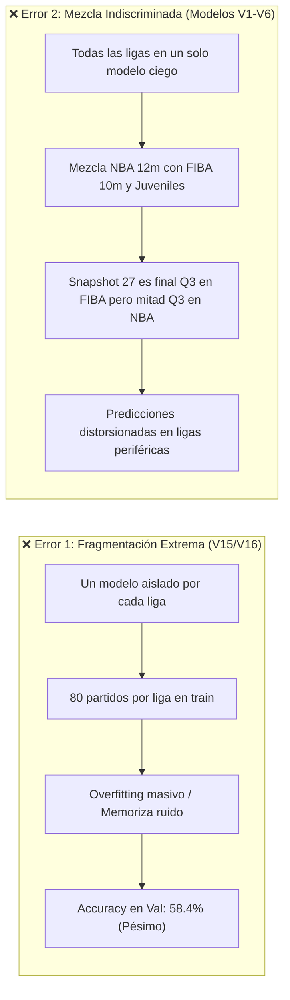
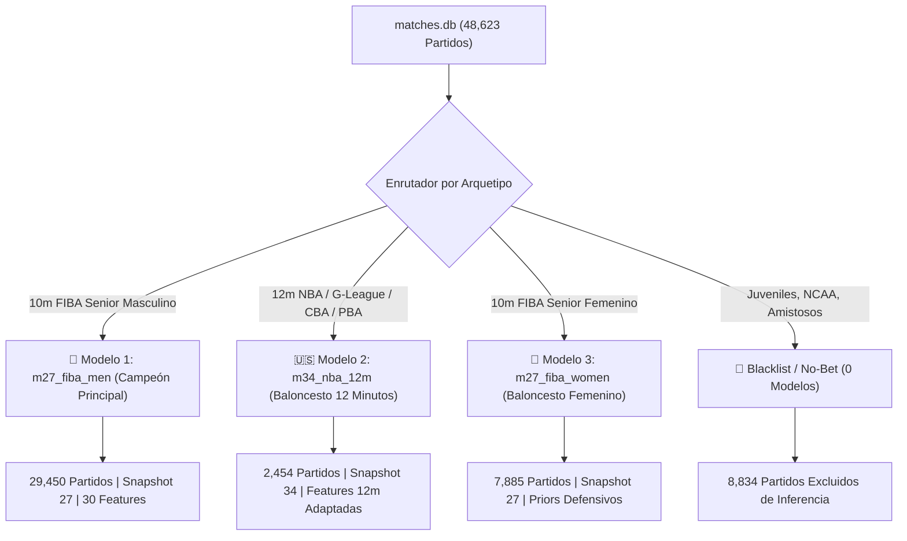

# 🏛️ Arquitectura Multi-Modelo, Mapeo de Ligas y Estrategia de Backfill

> **PROPÓSITO:** Este documento formaliza la estrategia definitiva de modelado predictivo para el sistema `pulpa`. Aprende de los errores históricos documentados (la fragmentación inviable de `V15/V16` vs la mezcla indiscriminada de modelos globales primitivos) y define **cuántos modelos entrenar**, **qué ligas y features corresponden a cada uno**, y **qué ligas requieren recolección histórica adicional (backfill)** para erradicar el sobreajuste por temporalidad (overfitting de una sola temporada).

---

## 🧠 1. Aprendiendo de Nuestros Errores: Dos Extremos Fallidos

El desarrollo histórico del proyecto demostró dos trampas estadísticas opuestas que debemos evitar a toda costa:

### El Tercer Riesgo Silencioso: El Sesgo de la Temporada Única (Single-Season Bias)
- Toda la base de datos [`matches.db`](file:///C:/Users/App/Desktop/pulpa/matches.db) (48,623 partidos) se recolectó entre **octubre de 2025 y octubre de 2026** (exactamente un ciclo anual de 12 meses).
- Si un modelo se entrena asociando victorias a nombres de clubes específicos (`home_team`, `away_team`), sufrirá de **suerte estacional**:
  - Creerá que el campeón coyuntural de 2026 gana siempre.
  - No comprenderá el recambio de plantillas, traspasos de verano ni regresión a la media.
- **Solución Obligatoria:** 
  1. Entrenar sin variables nominales de clubes; usar exclusivamente **Elo Dinámico ($\Delta \text{Elo}_{Q4}$)**, **Ratings de Titulares/Banquillo ($\Delta \text{Starters}$)** y **Momentum en Vivo ($m_{27}$)**.
  2. Ejecutar **Backfill Histórico** de temporadas 2024 y 2023 en las ligas estratégicas.

---

## 🎯 2. ¿Cuántos Modelos Entrenar? La Tríada Canónica

En lugar de 1,958 micromodelos o 1 macromodelo ciego, el sistema debe operar con **3 Modelos Especializados** por arquetipo reglamentario y una **Lista Negra (Blacklist)** permanente:

---

## 📋 3. Especificación Detallada de Cada Modelo

### 🏀 MODELO 1: `m27_fiba_men` (El Motor Central del Sistema)
- **Reglamento:** FIBA Senior Masculino, 4 cuartos de 10 minutos (40 min totales), reloj de tiro de 24 segundos.
- **Snapshot de Inferencia:** **Minuto 27** (a 3 minutos de finalizar Q3).
- **Volumen Actual en DB:** **29,450 partidos** (1,027 ligas y etapas catalogadas).
- **Ligas Principales Integradas:**
  - *Top Élite:* EuroLeague (359 matches), Liga ACB España (310), Germany BBL (302), France Pro A (244), Lega A Basket Italia (214), Turkish Super League (220).
  - *Segundas Divisiones y Ligas Nacionales:* Poland 2nd (893), Australia NBL (742), Serie A2 Italia (629), Serie B Italia (629), Liga Argentina (577), Japan B-League Premier (575), Brazil NBB (385), Puerto Rico BSN (197).
- **Features Especializadas (30 Variables):**
  - **Bloque M (12f):** Momentum en vivo ($m_{27}$), pendientes de 3m, diferencial de Q3 parcial y H2H directo.
  - **Bloque E (4f):** $\Delta \text{Elo}_{Q4}$ y $\Delta \text{Elo}_{FT}$ calculados cronológicamente sin data leakage.
  - **Bloque R (6f):** **Máximo peso en $\Delta \text{Bench Rating}$** ($r = +0.348$) y profundidad de banquillo; en Europa las rotaciones son de 10-12 hombres y deciden los cierres.
  - **Bloque L (8f):** Priors de `leagues_classification` (`scoring_pace_per_minute`, `is_playoffs`, `blowout_rate`).

---

### 🇺🇸 MODELO 2: `m34_nba_12m` (Especializado en Baloncesto de 12 Minutos)
- **Reglamento:** 4 cuartos de 12 minutos (48 min totales), posesión 24s.
- **Snapshot de Inferencia Obligatorio:** **Minuto 33 a 35** (en lugar del 27). Faltan entre 1 y 3 minutos para cerrar el tercer cuarto reglamentario de 36 minutos.
- **Volumen Actual en DB:** **2,454 partidos** (25 ligas y etapas catalogadas).
- **Ligas Principales Integradas:**
  - *NBA:* 1,222 partidos de temporada regular + 34 de playoffs + 27 Summer League.
  - *NBA G League:* 516 partidos de temporada regular + 10 playoffs.
  - *China CBA:* 372 partidos de temporada regular + 21 playoffs + torneos de copa.
  - *Filipinas PBA:* PBA Philippine Cup (55), Commissioner's Cup (51), Governors' Cup (25) y sus respectivos playoffs (~170 partidos totales).
- **Ajuste Crítico de Features para 12m:**
  - **Escala de Ventana:** Se redefinen las ventanas de momentum de $m_{24\text{-}27}$ a $m_{31\text{-}34}$.
  - **Mayor peso a `delta_star_reliance`:** En la NBA las superestrellas absorben el 35%+ del USG% en Q4 y juegan minutos extendidos; la profundidad de banquillo pesa menos que el talento de la estrella.
  - **Mayor peso a `recent_3pt_rate` y ritmo de transición:** El ritmo NBA es de **4.82 pts/min** (vs 3.85 en FIBA); una desventaja de 8 puntos se remonta en 90 segundos con dos triples y una pérdida.

---

### 👩 MODELO 3: `m27_fiba_women` (Especializado en Baloncesto Femenino)
- **Reglamento:** FIBA Senior Femenino, 4 cuartos de 10 minutos (40 min totales).
- **Snapshot de Inferencia:** **Minuto 27**.
- **Volumen Actual en DB:** **7,885 partidos** (360 ligas y etapas catalogadas).
- **Ligas Principales Integradas:**
  - *Top Élite:* Liga Femenina Endesa España (524 matches), WNBA (317), 1 Liga Kobiet Polonia (283), EuroLeague Women (180), KBSL Turquía (110), WNBL Australia (93).
  - *Ligas Nacionales:* LBF Brasil (81), BSNF Puerto Rico (79), Swiss League Women (80), Chile LNF (95).
- **Ajuste Crítico de Features para Baloncesto Femenino:**
  - **Línea Base Reducida:** Ritmo medio de **134.5 puntos** (3.36 pts/min frente a 3.85 en hombres).
  - **Menor volatilidad de triples:** Menor volumen relativo de triples de larga distancia en transición; los parciales se construyen en media cancha mediante defensas zonales y faltas tácticas.
  - **Fuerte penalización a `star_reliance`:** En el baloncesto femenino, los equipos que dependen de una sola anotadora sufren colapsos severos en Q4 cuando el rival ajusta defensas de ayudas dobles (correlación $-0.245$ con victoria en Q4).

---

### 🚫 GRUPO 4: BLACKLIST / NO-BET (Descartadas Totalmente de ML)
- **Volumen Actual:** **546 ligas / 8,834 partidos**.
- **Categorías Excluidas:**
  1. **Ligas Juveniles / Canteras (U16 a U23, ~4,200 partidos):** Volatilidad mental extrema, parciales erráticos de 18-0 en minutos basura, cambios de alineación por desarrollo educativo y no por ganar.
  2. **College NCAA (~3,100 partidos):** No juegan con 4 cuartos (juegan dos mitades de 20 minutos) y su reloj de posesión es de 30 segundos. Incompatible con el target de Q4.
  3. **Amistosos y Pretemporada (~1,500 partidos):** Sin incentivo competitivo real; los entrenadores prueban jugadores y sientan a las estrellas en los últimos cuartos.

---

## 🔍 4. Diagnóstico de Muestra: Ligas con Pocos Partidos y Riesgo de Overfitting

Al analizar [`matches.db`](file:///C:/Users/App/Desktop/pulpa/matches.db), descubrimos que la escasez de partidos obedece a **dos causas distintas**:

### Causa A: Falsa Escasez por Fragmentación de Nombres (Solucionada)
SofaScore divide una misma liga en múltiples strings:
- *Ejemplo Australia:* `NBL` (412) + `NBL, Championship Round` (48) + `NBL, Playoffs` (43) = **742 partidos reales**.
- *Ejemplo Italia:* `Serie A2, Girone Rosso` + `Girone Verde` + `Playoffs` = **629 partidos reales**.
- **Solución implementada:** La columna `clean_name` en `leagues_classification` agrupa automáticamente estas etapas bajo un mismo techo estadístico.

### Causa B: Verdadera Escasez por Temporada Única (Riesgo Real de Overfitting)
Como solo tenemos la temporada **2025-2026**, los torneos de formato corto o ligas nacionales con pocos equipos tienen muy pocas muestras. Si se entrenan modelos en ellas sin más datos, el modelo sobreajustará a la suerte de esa temporada.

---

## 📥 5. Plan Maestro de Backfill Histórico Prioritario

Para eliminar el riesgo de overfitting estacional, debemos recolectar datos históricos previos (temporadas **2024-2025** y **2023-2024**) mediante `menu.bat` (opción 10 / `fetch-date` / `fetch-range`).

A continuación se detalla la lista de **Ligas Estratégicas Candidatas a Backfill**:

| Liga Canónica (`clean_name`) | País / Región | Partidos Actuales (1 Año) | Partidos Esperados con Backfill (3 Años) | Modelo Asignado | Justificación de Negocio / Calidad |
| :--- | :---: | :---: | :---: | :---: | :--- |
| **NBA** | Estados Unidos | 1,258 | **~3,800** | `m34_nba_12m` | Mercado #1 mundial de apuestas. Permitirá entrenar un modelo 12m supermasivo. |
| **China CBA** | China | 393 | **~1,200** | `m34_nba_12m` | Segunda liga de 12 minutos más grande del mundo. Elimina varianza de plantillas. |
| **PBA Filipinas** | Filipinas | 170 | **~520** | `m34_nba_12m` | Formato de 3 copas anuales. Muy líquida en casas de apuestas asiáticas. |
| **Euroleague** | Internacional | 359 | **~1,100** | `m27_fiba_men` | Competición FIBA de clubes de mayor nivel del planeta. |
| **Liga ACB** | España | 310 | **~930** | `m27_fiba_men` | Liga nacional #1 de Europa en volumen de apuestas y estabilidad táctica. |
| **Germany BBL** | Alemania | 302 | **~900** | `m27_fiba_men` | Alta disciplina, scouting perfecto y datos PBP 100% completos. |
| **France Pro A** | Francia | 244 | **~750** | `m27_fiba_men` | Liga física y atlética con alta liquidez. Actualmente solo 244 partidos. |
| **Lega A Basket** | Italia | 214 | **~650** | `m27_fiba_men` | Liga histórica clave con baja muestra en la temporada 2025-26. |
| **Turkish Super League** | Turquía | 220 | **~660** | `m27_fiba_men` | Potencia continental (Efes, Fenerbahçe) con solo 220 partidos en DB. |
| **AdmiralBet ABA League** | Balcanes | 231 | **~700** | `m27_fiba_men` | Liga regional élite de formación y alta intensidad (Partizan, Estrella Roja). |
| **Mexico LNBP** | México | 207 | **~620** | `m27_fiba_men` | Liga rápida de transición con alta rentabilidad en momios en vivo. |
| **Puerto Rico BSN** | Puerto Rico | 197 | **~600** | `m27_fiba_men` | Liga de verano con muchos jugadores ex-NBA; clave para cubrir mayo-agosto. |
| **WNBA** | Estados Unidos | 317 | **~950** | `m27_fiba_women` | Liga reina femenina de verano. Muestra indispensable para cubrir junio-octubre. |
| **Liga Femenina Endesa** | España | 524 | **~1,500** | `m27_fiba_women` | Base de datos principal para el modelo femenino FIBA. |
| **EuroLeague Women** | Internacional | 180 | **~540** | `m27_fiba_women` | Máximo nivel femenino europeo; actualmente con baja muestra (180 matches). |

---

## 🛡️ 6. Reglas de Inferencia en Producción Según Soporte de Datos

Para que el monitor en vivo (`monitor_v2`) nunca cometa errores al recibir un partido con pocos antecedentes:

1. **Gate de Soporte Mínimo:**
   - Si una liga tiene **menos de 30 partidos** en `leagues_classification`, el monitor **emite señal `PASS` (No Apostar)** por falta de prior bayesiano fiable.
2. **Desacoplamiento de Identidad:**
   - Ningún modelo debe entrenarse con la variable categórica `league` como un simple número arbitrario. Debe usar siempre el vector de priors normalizados:
     $$\text{Priors Vector} = [\texttt{scoring\_pace\_per\_minute}, \texttt{avg\_q4\_total\_points}, \texttt{blowout\_rate}, \texttt{home\_win\_pct}]$$
   - Así, si entra una liga nueva pero sabemos que su ritmo es de $3.9 \text{ pts/min}$, el modelo sabe exactamente cómo comportarse sin haber visto nunca antes el nombre de esa liga.
3. **Desacoplamiento de Club:**
   - La fuerza del equipo se evalúa mediante su $\text{Elo}_{Q4}$ y el rating confirmado de sus 5 titulares presentes en la cancha, evitando la trampa de apostar al renombre del club cuando tiene suplentes jugando.

---

## 📌 7. Hoja de Ruta de Implementación

1. **Fase 1 (Inmediata):** Entrenar **`m27_fiba_men`** utilizando el dataset depurado de 29,450 partidos con las 30 features de [`docs/PROPUESTA_NUEVO_MODELO_M27_V4.md`](file:///C:/Users/App/Desktop/pulpa/docs/PROPUESTA_NUEVO_MODELO_M27_V4.md).
2. **Fase 2 (Backfill Focalizado):** Ejecutar descargas históricas de 2024 y 2025 para la **NBA** (llegar a 3,500+ partidos) y la **EuroLeague / ACB**.
3. **Fase 3 (Modelo NBA 12m):** Entrenar **`m34_nba_12m`** fijado al minuto 34 con el dataset extendido post-backfill.
4. **Fase 4 (Modelo Femenino):** Entrenar **`m27_fiba_women`** con las 7,885 muestras actuales + backfill de WNBA.
