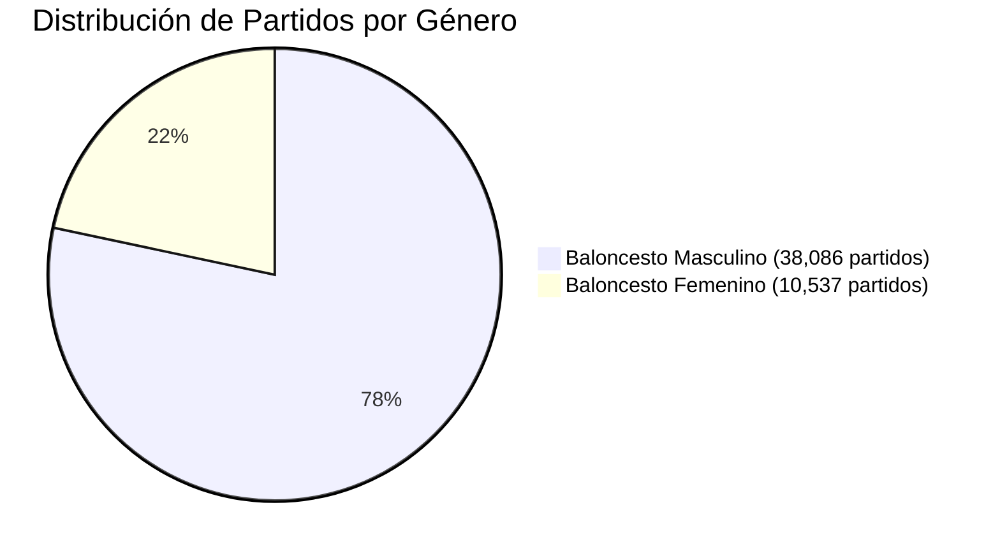

# 🏀 Clasificación Taxonómica y Tabla de Ligas (`leagues_classification`)

> **PROPÓSITO:** Este documento detalla la taxonomía multidimensional avanzada y el catálogo de metadatos de las **1,958 ligas y competiciones** registradas en [`matches.db`](file:///C:/Users/App/Desktop/pulpa/matches.db).
> Esta información está materializada en la tabla SQLite permanente `leagues_classification` (39 columnas enriquecidas con priors y métricas de volatilidad), permitiendo a cualquier modelo de Machine Learning, script de backfill o análisis EDA obtener *features* de contexto con un simple `JOIN`.

---

## 🏗️ 1. Definición y Ubicación de la Tabla

- **Ubicación Física:** Base de datos central [`matches.db`](file:///C:/Users/App/Desktop/pulpa/matches.db) en la raíz del proyecto.
- **Nombre de la Tabla:** `leagues_classification`.
- **Clave Primaria:** `league` (coincide exactamente con el valor del campo `matches.league`).
- **Población:** 1,958 registros únicos con cobertura sobre los 48,623 partidos.

### Esquema Relacional de `leagues_classification` (39 Columnas)

| Columna | Tipo SQLite | Nulo | Descripción Semántica / Rango de Valores |
| :--- | :--- | :---: | :--- |
| `league` | `TEXT (PK)` | No | Nombre exacto de la competición en `matches` (ej. `'Liga ACB, Playoffs'`). |
| `clean_name` | `TEXT` | No | Nombre base limpio sin fase o etapa (ej. `'Liga ACB'`). |
| `stage` | `TEXT` | No | Fase textual original (ej. `'Regular season'`, `'Playoffs'`, `'Finals'`). |
| `stage_detail` | `TEXT` | No | **Etapa granular:** `'Final / Championship'`, `'Semifinal / Final Four'`, `'Quarterfinal'`, `'Play-in'`, `'Relegation / Playout'`, `'Bronze / 3rd Place'`, `'Playoffs'`, `'Group Stage'`, `'Cup Stage'`, `'Regular Season'`. |
| `gender` | `TEXT` | No | Género: `'men'` (masculino) o `'women'` (femenino). |
| `is_women` | `INTEGER` | No | Flag binario: `1` si la liga es femenina, `0` si es masculina (auditado con vocablos y acrónimos internacionales). |
| `is_youth` | `INTEGER` | No | Flag binario: `1` si es categoría formativa (menores de 23 años). |
| `age_category` | `TEXT` | No | Rango de edad: `'Senior'`, `'U23'`, `'U21'`, `'U20'`, `'U19'`, `'U18'`, `'U16'`, `'Youth'`. |
| `is_college` | `INTEGER` | No | Flag binario: `1` si es baloncesto universitario (NCAA Division I/II/III, NAIA, NJCAA). |
| `competition_type` | `TEXT` | No | Tipo macro: `'league'`, `'playoffs'`, `'cup'`, `'friendly'`, `'all_star'`. |
| `is_tournament` | `INTEGER` | No | Flag binario: `1` si es copa, torneo corto o playoffs; `0` si es liga regular. |
| `is_playoffs` | `INTEGER` | No | Flag binario: `1` si corresponde a cualquier fase de postemporada. |
| `is_final` | `INTEGER` | No | **Flag binario:** `1` si es la **Gran Final por el título** (`championship game`, `finals`). |
| `is_semifinal` | `INTEGER` | No | Flag binario: `1` si es semifinal o Final Four. |
| `is_quarterfinal` | `INTEGER` | No | Flag binario: `1` si es cuartos de final. |
| `is_relegation` | `INTEGER` | No | Flag binario: `1` si es fase de descenso / playout / permanencia. |
| `is_international` | `INTEGER` | No | Flag binario: `1` si es torneo transnacional o de selecciones (Euroleague, FIBA, etc.). |
| `country_or_region`| `TEXT` | No | País o ámbito geográfico (ej. `'USA'`, `'Spain'`, `'Italy'`, `'Lithuania'`, `'International'`, etc.). |
| `confederation` | `TEXT` | No | Confederación deportiva: `'NBA'`, `'NCAA'`, `'FIBA_EUROPE'`, `'FIBA_AMERICAS'`, `'FIBA_ASIA'`, `'FIBA_OCEANIA'`, `'INTERNATIONAL'`. |
| `tier_level` | `TEXT` | No | Nivel: `'top_pro'`, `'second_pro'`, `'lower_pro_amateur'`, `'college'`, `'youth'`, `'standard_pro'`. |
| `quarter_duration_minutes` | `INTEGER` | No | Duración reglamentaria del cuarto: `12` (NBA, CBA, PBA) o `10` (FIBA, NCAA). |
| `total_game_minutes` | `INTEGER` | No | Duración reglamentaria total del partido: `48` o `40` minutos. |
| `match_count` | `INTEGER` | No | Total de partidos de esa liga en la base de datos. |
| `finished_match_count` | `INTEGER` | No | Partidos finalizados con marcador válido. |
| `avg_home_score` | `REAL` | Sí | Promedio de puntos anotados por el equipo local. |
| `avg_away_score` | `REAL` | Sí | Promedio de puntos anotados por el equipo visitante. |
| `avg_total_points` | `REAL` | Sí | Promedio global de puntos por partido (prior base Over/Under). |
| `points_std_dev` | `REAL` | Sí | **Desviación estándar de puntos totales** (volatilidad y dispersión del tanteo en la liga). |
| `scoring_pace_per_minute` | `REAL` | Sí | **Ritmo anotador por minuto de juego** (puntos totales / duración reglamentaria). Normaliza 10 vs 12 min. |
| `home_win_pct` | `REAL` | Sí | Porcentaje de victorias locales (% ventaja de localía). |
| `ot_rate` | `REAL` | Sí | Porcentaje de partidos terminados en prórroga (paridad competitiva). |
| `blowout_rate` | `REAL` | Sí | **% de partidos resueltos por $\ge 15$ puntos de margen** (partidos resueltos antes de Q4, minutos de suplentes). |
| `clutch_rate` | `REAL` | Sí | **% de partidos resueltos por $\le 5$ puntos de margen** (máxima intensidad defensiva en Q4). |
| `avg_q4_total_points` | `REAL` | Sí | Promedio de puntos combinados en el 4º cuarto (prior directo para modelos Q4). |
| `avg_q4_margin` | `REAL` | Sí | Diferencia absoluta promedio de puntos en el 4º cuarto. |
| `q4_home_win_pct` | `REAL` | Sí | **% de veces que el local gana específicamente el 4º cuarto** (ventaja de localía en el cierre). |
| `q4_points_ratio` | `REAL` | Sí | Porcentaje de la anotación total que ocurre en Q4 (habitualmente 24-26%). |
| `pbp_coverage_pct` | `REAL` | No | Porcentaje de partidos con jugadas anotadoras (`play_by_play`). |
| `graph_coverage_pct`| `REAL` | No | Porcentaje de partidos con curva de momentum (`graph_points`). |
| `updated_at` | `TEXT` | No | Timestamp ISO de la última consolidación. |

---

## 🔍 2. Auditoría Profunda de Ligas Femeninas

Muchas competiciones no contienen la palabra inglesa `"women"` en su título, sino acrónimos locales o palabras en otros idiomas. Tras una auditoría cruzada exhaustiva de términos internacionales y nombres de torneos, se identificaron **556 ligas femeninas** (10,537 partidos, 21.7% del total).

### Casos de Detección No Estándar Recuperados:
1. **España (`LF`):** `LF Challenge` (190 partidos), `LF Endesa`, `LF2` (Liga Femenina).
2. **Alemania (`DBBL` / `Damen`):** `1st DBBL` (93 partidos), `2. DBBL North/South` (Damen-Basketball-Bundesliga).
3. **Turquía (`Kadınlar` / `KBSL` / `TKBL`):** `Türkiye Kadınlar Basketbol Ligi` (40 partidos), `Kadınlar Bölgesel` (*Kadınlar* = Mujeres en turco).
4. **República Checa / Eslovaquia (`ŽBL` / `Ženy`):** `ZBL Playoffs`, `ZBL Championship Round` (*Ženská Basketbalová Liga*).
5. **Hungría (`Női`):** `Női Amatőr NB 1` (*Női* = Femenino en húngaro, 50 partidos).
6. **Balcanes / Croacia (`Ženska` / `ŽLS` / `WABA`):** `Premijer ženska liga` (102 partidos), `WABA League` (Women Adriatic Basketball Association).
7. **Brasil (`Fem` / `LNBF` / `LBF`):** `CBI U15 Fem`, `CBI U17 Fem` (147 partidos), `Seleções Fem`, `LNBF` (Liga Nacional de Basquete Feminino).
8. **Polonia (`Kobiet`):** `1 Liga Kobiet`, `Basket Liga Kobiet` (*Kobiety* = Mujeres en polaco).
9. **Lituania / Letonia / Nórdicos:** `MLKL` (*Moterų*), `WBBL`, `Dameligaen`, `Korisliiga Naiset`.



### Métricas Comparativas de Género
- **Puntos Promedio:** `154.5 pts` (Masculino) vs `134.5 pts` (Femenino) $\rightarrow$ **-20.0 puntos de diferencia**.
- **Ritmo de Anotación (`pace`):** `3.85 pts/min` (Masculino) vs `3.36 pts/min` (Femenino).
- **Ventaja de Localía:** `56.9%` (Masculino) vs `55.5%` (Femenino).

---

## 🏆 3. Clasificación de Fases y Partidos Finales

Se catalogaron las etapas de competición en 10 categorías granulares mediante `stage_detail`:

| Etapa Granular (`stage_detail`) | Ligas / Fases | Partidos Totales | Descripción y Comportamiento Táctico |
| :--- | :---: | :---: | :--- |
| **`Regular Season`** | 898 | 37,786 | Fase regular de calendario estándar. Rotaciones normales. |
| **`Group Stage`** | 456 | 6,923 | Fases de grupos en copas o torneos internacionales. |
| **`Cup Stage`** | 187 | 1,435 | Rondas de eliminación de copa (Copa del Rey, Pokal, etc.). |
| **`Playoffs`** | 143 | 1,267 | Rondas de cuartos, series al mejor de 3 o 5. |
| **`Relegation / Playout`** | 50 | 546 | **Lucha por la permanencia / descenso.** Altísima tensión y faltas tácticas. |
| **`Final / Championship`** | 84 | 366 | **Gran Final por el título.** Minutos clave para estrellas, rotación corta. |
| **`Semifinal / Final Four`** | 64 | 112 | Semifinales y semifinales de Final Four. |
| **`Quarterfinal`** | 27 | 77 | Cuartos de final específicos. |
| **`Play-in`** | 16 | 67 | Torneos eliminatorios Play-in (acceso a playoffs). |
| **`Bronze / 3rd Place`** | 33 | 44 | Partidos de consolación por la medalla de bronce. Menor intensidad defensiva. |

---

## 📈 4. Métricas Avanzadas para Machine Learning

Las nuevas métricas añadidas a `leagues_classification` resuelven problemas críticos en el entrenamiento de modelos:

1. **`scoring_pace_per_minute` (Ritmo Normalizado):**
   - Elimina la distorsión entre cuartos de 10 min y 12 min. Un partido NBA tiene pace de ~4.78 pts/min mientras que la ACB tiene ~4.17 pts/min.
2. **`blowout_rate` vs `clutch_rate` (Predicción de Conducta en Q4):**
   - Ligas formativas o desbalanceadas tienen `blowout_rate` > 45%: en el cuarto 4 juegan reservas y el ritmo cae drásticamente.
   - Ligas ultracompetitivas (Euroleague, ACB, NBA Playoffs) tienen `clutch_rate` > 25%: los titulares juegan los 10/12 minutos de Q4.
3. **`points_std_dev` (Volatilidad de Totales):**
   - Cuantifica la incertidumbre intrínseca de la liga para ajustar el tamaño de apuesta o *kelly criterion*.
4. **`q4_home_win_pct` vs `home_win_pct`:**
   - Detecta si el equipo local se desinfla o acelera en el cuarto final.

---

## 💻 5. Ejemplos de Consultas SQL para ML y EDAs

### Extraer Features Completas para Entrenamiento de Modelos Q4:
```sql
SELECT 
    m.match_id,
    m.date,
    m.league,
    m.home_team,
    m.away_team,
    -- Contexto categórico:
    lc.gender,
    lc.is_women,
    lc.is_youth,
    lc.is_college,
    lc.stage_detail,
    lc.is_final,
    lc.is_playoffs,
    lc.is_relegation,
    lc.confederation,
    lc.tier_level,
    -- Duración:
    lc.quarter_duration_minutes,
    -- Priors cuantitativos de la liga:
    lc.scoring_pace_per_minute  AS prior_pace,
    lc.avg_total_points         AS prior_total_points,
    lc.points_std_dev           AS prior_std_points,
    lc.avg_q4_total_points      AS prior_q4_points,
    lc.avg_q4_margin            AS prior_q4_margin,
    lc.home_win_pct             AS prior_home_advantage,
    lc.q4_home_win_pct          AS prior_q4_home_advantage,
    lc.blowout_rate             AS prior_blowout_risk,
    lc.clutch_rate              AS prior_clutch_chance
FROM matches m
JOIN leagues_classification lc ON m.league = lc.league
WHERE m.status_type = 'finished'
ORDER BY m.date DESC;
```
