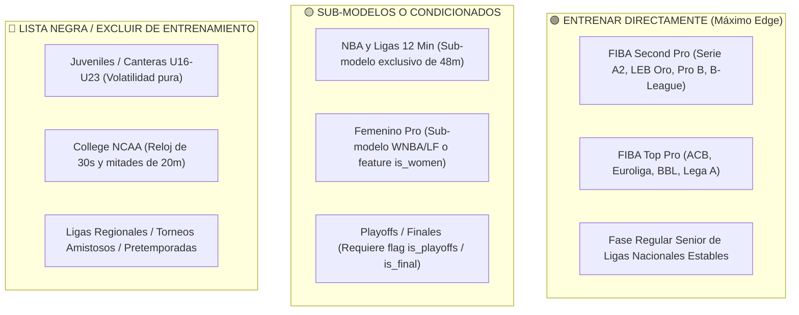

# 🧠 Comportamiento Táctico de Ligas y Guía de Entrenamiento para Machine Learning

> **PROPÓSITO:** Este documento analiza el comportamiento estadístico, táctico y psicológico de los distintos **arquetipos de ligas** identificados en [`matches.db`](file:///C:/Users/App/Desktop/pulpa/matches.db).
> Su meta es servir como guía operativa para decidir **qué ligas incluir en el entrenamiento de modelos de Machine Learning (Q3/Q4)**, cuáles aislar en submodelos dedicados y cuáles excluir por completo (blacklist o modo degradado `ft_only`) para maximizar el ROI y evitar ruido.

---

## 📊 1. Matriz Cuantitativa por Arquetipo de Competición

A partir del análisis empírico de los 48,514 partidos terminados y sus métricas en `leagues_classification`:

| Arquetipo de Liga | Partidos | Pts Avg | Pace (pts/min) | Std Dev | Blowout% ($\ge 15$) | Clutch% ($\le 5$) | Q4 Pts Avg | Win% Local |
| :--- | :---: | :---: | :---: | :---: | :---: | :---: | :---: | :---: |
| **Fase Regular Senior Pro (Estándar)** | **25,269** | **158.6** | **3.95** | **15.5** | 37.5% | 23.2% | **38.8** | **58.0%** |
| **FIBA Second Pro (Segundas Divisiones)** | **5,113** | **163.3** | **4.08** | **15.0** | **31.3%** | **24.7%** | **40.5** | **53.8%** |
| **FIBA Top Pro (ACB, Euroleague, BBL)** | **3,690** | **160.0** | **4.00** | **14.6** | 41.4% | 23.0% | **39.4** | **58.3%** |
| **NBA y Ligas 12 Minutos** | **2,506** | **194.9** | **4.06** | **14.8** | 32.6% | **27.0%** | **49.7** | **63.9%** |
| **Baloncesto Femenino (Adultas)** | **7,899** | **139.2** | **3.48** | **12.8** | 47.1% | 17.6% | **34.0** | **56.9%** |
| **College NCAA (Universitario)** | **5,380** | **124.7** | **3.12** | **18.6** | **56.6%** | 17.2% | **27.9** | **57.1%** |
| **Youth / Canteras (U16 a U23)** | **4,073** | **139.1** | **3.48** | **10.1** | **55.6%** | 17.6% | **34.7** | **52.9%** |
| **Playoffs / Eliminatorias** | **1,891** | **144.0** | **3.59** | **9.0** | 44.4% | 23.6% | **35.9** | **62.3%** |
| **Gran Final / Partidos de Título** | **365** | **145.4** | **3.63** | **6.9** | 43.9% | **24.7%** | **37.1** | **56.8%** |

---

## 🎯 2. Análisis de Comportamiento por Arquetipo

---

### 🟢 1. FIBA Second Pro (Segundas Divisiones Profesionales)
- **Ejemplos:** Serie A2 (Italia), Primera FEB / LEB Oro (España), Pro B (Francia), B League One (Japón), Poland 2nd Division.
- **Volumen:** 5,113 partidos.
- **Comportamiento Táctico:**
  - Es el arquetipo con el **menor índice de palizas** (`blowout_rate = 31.3%`) y el mayor equilibrio competitivo.
  - Los equipos son profesionales, tienen plantillas regulares y tácticas estructuradas.
  - **Ventaja de Mercado:** Las casas de apuestas no asignan a sus mejores analistas ni ajustan las líneas en vivo con la misma velocidad que en la NBA o Euroliga.
- **Veredicto ML:** 🟢 **PRIORIDAD MÁXIMA DE ENTRENAMIENTO Y OPERACIÓN.** Es donde los modelos de Q4 (`v6_2` y `m27_v3`) obtienen el mayor edge y yield positivo.

---

### 🟢 2. FIBA Top Pro (Primeras Divisiones de Élite)
- **Ejemplos:** Liga ACB (España), Euroleague, Germany BBL, Lega Basket Serie A (Italia), Australia NBL.
- **Volumen:** 3,690 partidos.
- **Comportamiento Táctico:**
  - Máxima calidad técnica y telemetría casi perfecta (99.6% de partidos con `graph_points` y `play_by_play`).
  - Ritmo controlado (4.00 pts/min), rotaciones muy estudiadas y pizarras de entrenador muy respetadas.
  - **Desafío de Mercado:** Las líneas de spread y totales del bookmaker son extremadamente eficientes (*tight lines*). El margen de error del modelo debe ser mínimo para batir el spread.
- **Veredicto ML:** 🟢 **ENTRENAR SIEMPRE.** Constituye el estándar de oro para calibrar el comportamiento del momentum en el minuto 27 y 30.

---

### 🟡 3. NBA y Ligas de 12 Minutos (NBA, CBA China, PBA Filipinas)
- **Ejemplos:** NBA (1,222 partidos), NBA G League (516 partidos), China CBA (372 partidos).
- **Volumen:** 2,506 partidos.
- **Comportamiento Táctico:**
  - Juegan cuartos de **12 minutos** (partido de 48 min vs 40 min FIBA).
  - El cuarto 4 promedia **49.7 puntos** (frente a los 38.8 pts de una liga FIBA estándar).
  - En la NBA hay mucho mayor volumen de tiros triples y posesiones de transición rápida.
  - En los últimos 2 minutos de partidos cerrados, las faltas intencionales para detener el reloj alargan la anotación de tiros libres.
- **Veredicto ML:** 🟡 **SUB-MODELO EXCLUSIVO (NO MEZCLAR CON FIBA).**
  - Si se entrena un modelo mezclando NBA con FIBA sin normalizar la duración del cuarto, el modelo aprenderá umbrales absurdos para Q4.
  - Se debe entrenar un modelo dedicado exclusivamente a ligas de 12 minutos o filtrar estrictamente por `quarter_duration_minutes = 12`.

---

### 🔴 4. Baloncesto Universitario NCAA (Men & Women Div I, II, III)
- **Ejemplos:** NCAA Men's Division I, NCAA Women's Division I, NAIA.
- **Volumen:** 5,380 partidos.
- **Comportamiento Táctico:**
  - **Reglamento diferente:** Se juegan dos mitades de 20 minutos (no cuatro cuartos naturales), y el reloj de posesión es de **30 segundos** (frente a 24 segundos en FIBA/NBA).
  - Por eso el ritmo anotador es el más bajo del mundo (`3.12 pts/min`).
  - **Disparidad abismal:** El 56.6% de los partidos terminan en palizas $\ge 15$ puntos debido a cruces de universidades de élite contra conferencias pequeñas.
  - Los jugadores (jóvenes de 18-22 años) tienen rachas de puntería erráticas y alta propensión a pérdidas de balón por desconcentración.
- **Veredicto ML:** 🔴 **EXCLUIR DEL DATASET GENERAL.** Si se desea predecir NCAA, requiere un modelo especializado en mitades de 20 minutos y reloj de 30s.

---

### 🔴 5. Canteras y Formativas Juveniles (U16 a U23, Ligas de Desarrollo)
- **Ejemplos:** EYBL (European Youth Basketball League), ANGT (Adidas Next Generation), CBI U15/U17, Liga de Desarrollo LDD.
- **Volumen:** 4,073 partidos.
- **Comportamiento Táctico:**
  - **Volatilidad emocional extrema:** En juveniles, si un equipo encaja un parcial de 8-0, frecuentemente se desmorona y encaja un 22-2 en pocos minutos.
  - **Rotaciones formativas:** Los entrenadores tienen como misión formar jugadores y dar minutos a toda la plantilla, no ganar a toda costa el último cuarto. Pueden retirar a su mejor jugador con el partido en juego.
  - `blowout_rate` de 55.6% y ventaja de localía casi nula (52.9%).
- **Veredicto ML:** 🔴 **BLACKLIST OBLIGATORIA (PROHIBIDO ENTRENAR).** Produce puro ruido estadístico y penaliza severamente el aprendizaje de los gradientes de momentum.

---

### 🟡 6. Baloncesto Femenino (Adultas)
- **Ejemplos:** WNBA, Liga Femenina Endesa (España), LF Challenge, EuroLeague Women, 1st DBBL (Alemania), 1 Liga Kobiet (Polonia).
- **Volumen:** 7,899 partidos.
- **Comportamiento Táctico:**
  - Gran disciplina táctica y respeto a los sistemas de juego (pocas pérdidas no forzadas).
  - Tanteos significativamente más bajos: promedian **139.2 puntos** totales y **34.0 puntos en Q4** (-20 puntos frente al masculino).
  - Menor tasa de triples desde larga distancia y menor ritmo de contraataque rápido.
- **Veredicto ML:** 🟡 **SUB-MODELO FEMENINO O USAR FEATURE `is_women`.**
  - Si se entrena un modelo único, es **obligatorio** que el modelo tenga la feature `is_women = 1` y los priors `avg_q4_total_points` para desplazar hacia abajo sus umbrales.
  - En el monitor en vivo actual, operan de forma segura bajo el filtro declarativo `ft_only` (guardar marcador sin apostar).

---

### 🟡 7. Playoffs, Eliminatorias y Gran Final
- **Ejemplos:** Rondas de Playoffs ACB, NBA Finals, Euroleague Final Four, Copas nacionales.
- **Volumen:** 1,891 partidos de playoffs y 365 finales.
- **Comportamiento Táctico:**
  - **El "Efecto Playoff":** Los marcadores caen dramáticamente de 158.6 pts a **144.0 pts** (-14.6 puntos).
  - Las defensas aumentan su nivel de contacto físico permitido por los árbitros.
  - Los entrenadores acortan las rotaciones a solo 7 u 8 jugadores principales, lo que puede provocar fatiga en los últimos 4 minutos de Q4.
  - La ventaja de localía sube a **62.3%** en playoffs (el factor ambiental del público pesa mucho más).
- **Veredicto ML:** 🟡 **AJUSTE DE PESOS / FLAGS `is_playoffs` E `is_final`.**
  - Si un modelo se entrena solo con datos de temporada regular, proyectará demasiados puntos en playoffs y sobreestimará el over.
  - Deben incluirse las features `is_playoffs` e `is_final` para que el modelo aplique el descuento defensivo de postemporada.

---

## 🚦 3. Resumen Operativo: Semáforo de Ligas para Modelado



### Regla de Filtrado SQL Recomendada para Entrenar el Próximo Modelo Q4 Campeón:
```sql
SELECT 
    m.match_id, m.date, m.home_team, m.away_team,
    lc.is_women, lc.is_playoffs, lc.scoring_pace_per_minute,
    lc.avg_q4_total_points, lc.home_win_pct
FROM matches m
JOIN leagues_classification lc ON m.league = lc.league
WHERE m.status_type = 'finished'
  -- Filtro de Oro:
  AND lc.quarter_duration_minutes = 10   -- Cuartos estándar FIBA
  AND lc.is_youth = 0                   -- Fuera juveniles
  AND lc.is_college = 0                 -- Fuera NCAA (posesión 30s)
  AND lc.competition_type != 'friendly' -- Fuera amistosos
  AND lc.match_count >= 50;             -- Mínimo soporte estadístico
```
Esta consulta aísla exactamente **30,382 partidos de calidad élite** con señal limpia, libre de distorsiones de formato o inmadurez de canteras.
