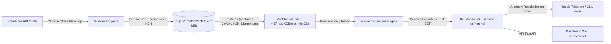

> **Ubicación original:** ESTADO_DEL_PROYECTO.md (Raíz)

---

# 🏀 Pulpa — Exploración Integral y Estado del Repositorio

> **Fecha de documentación:** Octubre 2026  
> **Ubicación:** Raíz del proyecto (`ESTADO_DEL_PROYECTO.md`)  
> **Último Commit Analizado:** `b0c6583` (*"ultimoi commit"*)

---

## 1. ¿Qué es este Repositorio y Qué Hace?

**Pulpa** es un sistema cuantitativo avanzado y automatizado para el **monitoreo en tiempo real, predicción estadística y gestión de apuestas deportivas en baloncesto** (NBA y más de 1,200 ligas internacionales FIBA). 

El sistema está enfocado principalmente en la predicción del **ganador del 4to cuarto (Q4)** (y en etapas previas también del 3er cuarto Q3) evaluando el partido en momentos clave previos al inicio del periodo (particularmente en el **minuto 27** de juego).

### Flujo Operativo de Extremo a Extremo:


---

## 2. Arquitectura del Código y Componentes

El proyecto se divide en módulos claramente delimitados:

### 📁 `monitor_v2/` (Daemon Asíncrono de Monitoreo Modular)
Reemplaza la versión monolítica anterior por una arquitectura desacoplada basada en `asyncio`:
- **`main.py`**: Event loop principal. Gestiona el ciclo de vida de los partidos (`_watch_match`), espaciado anti-baneos (20s entre watchers), sondeo adaptativo según el ritmo (`secs_per_gmin`) y menú de arranque interactivo.
- **`config/`**: Constantes operativas (`constants.py`) y reglas declarativas de ligas (`leagues.yaml`: ligas excluidas y ligas `ft_only` para solo guardar resultado sin apostar).
- **`database/`**: Conexión SQLite con modo WAL y repositorio transaccional (`repository.py` con tablas terminadas en `_v2`).
- **`models/evaluator.py`**: Orquestador de inferencia en tiempo real. Carga en caché singleton los artefactos campeones (`v6_2` y `m27_v3`).
- **`scrapers/`**: Soporte multi-backend (`browser_client.py` con Playwright/Chrome nativo y `live_scraper.py`).
- **`notifications/telegram_bot.py`**: Despacho de alertas inmediatas con emojis de estado (🟢 Bettable, 🟡 No Bettable, ⚪ Tardía, ✅ Ganada, ❌ Perdida).
- **`utils/`**: Logger coloreado ANSI (`logger.py`) y estimadores de tiempo adaptativo (`helpers.py`).

### 📁 `monitor_v1/` (Monitor Clásico y Bot de Telegram V1)
Módulo legacy para monitoreo en vivo y bot interactivo de Telegram:
- **`main.py`**: Entry point para lanzar el bot / monitor V1.
- **`telegram_bot.py`**: Bot de interacción con menú completo (stats, búsqueda por ID, reportes mensuales y envío de Excels).
- **`bet_monitor.py`**: Monitor en vivo V1 con caching local de itinerarios de 2 horas en `api_cache/`.
- **`test_keyboard_functions.py`**: Suite de pruebas para teclados interactivos de Telegram.
- **`FILTROS_LIGAS.md`**: Reglas y documentación de ligas para V1.

### 📁 `match/` (Núcleo Tradicional, Scraping, CLI y Entrenamiento ML)
- **`matches.db`**: Ubicada en la raíz del proyecto (`matches.db`, ~737 MB):
  - **39,988** partidos analizados.
  - **154,003** marcadores de cuartos individuales (`quarter_scores`).
  - **2,972,729** eventos play-by-play (`play_by_play`).
  - **1,362,909** puntos de momentum/presión (`graph_points`).
  - **354,829** registros de enfrentamientos directos (`match_h2h`).
  - **10,000+** señales históricas registradas y evaluadas (`bet_monitor_log` y `bet_monitor_log_v2`).
- **`scraper.py`**: Módulo de scraping robusto. Utiliza conexión CDP a Chrome con llamadas internas JavaScript (`page.evaluate(fetch(...))`) que superan la protección Cloudflare de SofaScore.
- **`cli.py`**: Interfaz de línea de comandos para ingestión por fechas, reentrenamiento y reportes comparativos.
- **`training/`**: Pipeline de Machine Learning completo (ver Sección 3).

### 📁 `tools/` (Herramientas Analíticas Avanzadas)
- **`stats_cli.py` (3,144 líneas)**: Centro neurálgico de analítica post-partido.
  - Implementa el **`FusionConsensusEngine`** (fusión ponderada de predicciones entre `v6_2` y `m27_v3`).
  - Filtros avanzados de clasificación: ligas femeninas, ligas juveniles (U18/U19/U21), cuartos de 12 minutos (NBA) vs 10 minutos (FIBA), y rondas de Playoffs vs Temporada Regular.
  - Generador de reportes en Excel (`export_matches_to_excel`, `export_matches_monthly_to_excel`) y exportación sintética para IA (`MetaModel_ALL.txt`).
- **`test_fast_historical.py`**: Motor de prueba ultrarrápido para evaluar modelos sobre miles de partidos en memoria.
- **`obscura-src/`**: Submódulo git con modificaciones en Rust al motor headless Obscura.

### 📁 `findings/` (Investigación y Hallazgos Cuantitativos)
Contiene análisis estadísticos exhaustivos de por qué funcionan (o fallan) los modelos:
- **`modelos.md` (41 KB)**: Registro enciclopédico de cada modelo, sus estadísticas, hiperparámetros, catálogo de features y hallazgos.
- **`findings.md`**: Resumen ejecutivo de snapshots, correlaciones y feature importance.
- **`M27_V1_ROADMAP.md`** y **`M27_V2_ROADMAP.md`**: Hoja de ruta técnica de los modelos evaluados al minuto 27.
- **`ligas_10min.md` (1,185 ligas)** y **`ligas_12min.md` (16 ligas)**: Clasificación de duración de cuartos reglamentarios.

### 📁 `dashboard/` y `api.py`
- **`api.py`**: API REST en FastAPI que expone endpoints para consultar partidos por fecha, histórico de señales y progreso en vivo.
- **`dashboard/`**: SPA en React + Vite + TypeScript con tablas dinámicas y métricas visuales.

### 📄 Archivos de Automatización
- **`menu.bat`**: Centro de control interactivo por consola organizado en 5 bloques operativos (Operación en Vivo, Análisis/Consenso, Ingesta/Backfill, Modelos ML y Mantenimiento, con soporte CLI para automatización) que cubre todo el flujo de trabajo sin necesidad de scripts dispersos.

---

## 3. Catálogo de Features del Sistema

Todos los modelos se construyen a partir de un catálogo modular de variables organizadas por familias:

### 🧩 Familias F (Modelos Clásicos y Serie M27/M30)
- **F0 — Marcadores por Cuarto (Core):** `q1_diff`, `q2_diff`, `q3_diff`, `ht_home`, `ht_away`, `ht_diff`, `ht_total`, `score_3q_home/away/diff`, `score_est_home/away/diff`, `cutoff_minute`.
- **F1 — Win Rates Previos:** `home_prior_wr`, `away_prior_wr`, `prior_wr_diff`, `prior_wr_sum`.
- **F2 — Graph Points (Momentum):** `gp_count`, `gp_last`, `gp_peak_home/away`, `gp_area_home/away/diff`, `gp_swings`, `gp_slope_3m`, `gp_slope_5m`.
- **F3 — Play-by-Play (PBP Stats):** Puntos por jugada, cantidad de triples, posesiones relativas y diferencias ofensivas por equipo.
- **F4 — Buckets Categóricos:** Ligas, divisiones por género y buckets de equipos (o strings crudos en CatBoost).
- **F5 — Score Pressure:** Urgencia de anotación para empatar/liderar (`required_ppm_tie`, `required_ppm_lead`, `pressure_ratio_tie`, `urgency_index`).
- **F6 — Clutch / Ventanas Recientes:** Puntos, rachas máximas y diferencial anotador en ventanas inmediatas antes del snapshot.
- **F7 — Simulación Monte Carlo:** Probabilidades simuladas de victoria (`mc_home_win_prob`, `mc_expected_diff`, `mc_cover_rate`, `mc_comeback_rate`).
- **F8 — Scoring Runs:** Racha actual y máxima por equipo (`current_run_home/away`, `max_run_home/away`, `run_diff`).
- **F9 — Ganadores Previos:** `q1_winner`, `q2_winner`, `q1_q2_same_winner`, conteo de cuartos ganados en la primera mitad.
- **F10 — Contexto de Halftime:** `halftime_home/away/diff/total`, `halftime_leader`, `halftime_margin_bin`, `halftime_deficit_abs`.
- **F11 — Contexto de Marcador Actual:** `current_margin_bin`, `trailing_now_deficit_abs`, rachas recientes del equipo en desventaja.
- **F12 — Contexto Parcial de Q3:** `q3_partial_home/away/diff/total`, delta respecto al medio tiempo y share anotador.
- **F13 — Momentum Profundo Q3 (m30):** Erosión de ventaja, aceleración del momentum, volatilidad y puntos de inflexión.
- **F14 — Ritmo y Proyección Q3:** Duración reglamentaria del cuarto (10m vs 12m), ritmo por minuto y proyección de cierre de cuarto.
- **F15 — Análisis del Rezagado de Halftime:** Comportamiento y recuperación del equipo que iba perdiendo al medio tiempo.
- **H2H — Enfrentamientos Directos (`m27_v3`):** `h2h_last_home_won` (ganador del último encuentro), `h2h_recent3_home_won` (% victorias en últimos 3), `h2h_avg_q1_diff` (diferencial medio en Q1 histórico).

### 🧩 Familias G (Serie V13+ de Alta Producción)
- **G1 (Score):** Ratios del marcador al medio tiempo, acumulados y momentum Q3 vs HT.
- **G2 (Graph/Trajectory):** Aceleración, amplitudes, cruces por cero (`gp_sign_changes`) y desviación estándar.
- **G3 (Trayectoria):** Cambios de liderazgo (`traj_lead_changes`), empates y diferencial en las últimas 5/10 posesiones.
- **G4 (PBP Density):** Densidad anotadora, tasa de triples y puntos por evento.
- **G5 (Pace):** Ritmo relativo contra la mediana de la liga (buckets bajo/medio/alto).
- **G6 (Contexto de Liga):** Medias históricas y desviación estándar de puntos por cuarto y ventaja de localía por liga.
- **G7 (Meta):** Minuto del snapshot, target y minutos restantes.
- **G8 (Forecast):** Pronósticos de modelos fundacionales de series de tiempo (**Google TimesFM** y **Amazon Chronos**).
- **G9 (Legacy Hybrid):** Integración retrocompatible de presión, clutch y Monte Carlo.

---

## 4. Genealogía y Fichas Técnicas de Todos los Modelos

A continuación se detalla la evolución técnica, algoritmos y hallazgos de cada modelo desarrollado en el repositorio:

### 🔹 Fase 1: Modelos Clásicos y Exploratorios (V1 – V9)

#### V1 — Baseline Original
- **Snapshot:** Minuto 36 (Q4 con Q3 completo).
- **Algoritmo:** Ensamble promedio: Regresión Logística + Random Forest + Gradient Boosting.
- **Target:** Q3 y Q4. Split temporal 80/20. Sin filtros de exclusión.
- **ROC AUC:** ~0.857 (con datos completos al minuto 36).
- **Hallazgo:** Demostró viabilidad pero dependía de un snapshot tardío inviable para operar con suficiente anticipación.

#### V2 — Buckets de Liga y Equipos
- **Snapshot:** 36.
- **Algoritmo:** LogReg + RF + GB con mayor cantidad de estimadores y menor learning rate.
- **Features:** F0, F1, F2, F3 y se introducen **F4** (League/Team buckets).
- **ROC AUC:** **0.865**, Accuracy 0.774 en 4,304 partidos de test.

#### V3 — Primer Ensayo Multi-Snapshot
- **Snapshot:** Múltiples por juego (minutos 24, 30 y 36).
- **Algoritmo:** LogReg + GB (se elimina Random Forest).
- **ROC AUC:** 0.472 (m24), 0.754 (m30), 0.819 (m36).
- **Hallazgo:** Primera confirmación de que predecir con demasiada anticipación (m24) degrada el AUC a niveles de azar si no hay suficientes datos del juego en curso.

#### V4 — Variables de Presión y Remontada
- **Snapshot:** 36.
- **Features:** Incorpora **F5** (Score Pressure, 22 features) y **F6** (Clutch recent window, 11 features).
- **ROC AUC:** 0.848, Accuracy 0.760 en 1,284 partidos de test.

#### V5 — Stack Moderno: XGBoost + HistGB + MLP
- **Snapshot:** Q3 (24), Q4 (36).
- **Algoritmo:** **XGBoost + HistGradientBoosting + Multi-Layer Perceptron (Red Neuronal)**.
- **ROC AUC:** XGB: 0.846, HistGB: 0.845, MLP: 0.855.
- **Hallazgo:** Se establece la combinación XGBoost + HistGB que sirve de columna vertebral para los modelos futuros.

#### V6 — Simulación Monte Carlo y Referencia Histórica
- **Snapshot:** Q3 (24), Q4 (36).
- **Algoritmo:** XGBoost + HistGB + MLP con 5,000 simulaciones Monte Carlo por partido.
- **Features:** F0 a F6 + **F7** (`mc_home_win_prob`).
- **ROC AUC:** **0.857**, Accuracy 0.765 (4,284 partidos de test). Modelo de referencia para todas las iteraciones V6.

#### V6.1 — Calibración Isotónica y Split 70/15/15
- **Novedades:** Introduce validación cruzada TimeSeriesSplit (5 folds), calibración isotónica post-hoc y ensemble ponderado por AUC.
- **ROC AUC:** 0.847, Accuracy 0.756.

#### V6.2 — League Pruning (Poda Automática de Ligas)
- **Snapshot:** Q3 (24), Q4 (36).
- **Algoritmo:** Blend: `0.6 * XGBoost + 0.4 * HistGradientBoosting` (se elimina MLP).
- **Innovación:** **Poda de ligas débiles** (ligas con ruido se agrupan en `LEAGUE_OTHER_SIGNAL_WEAK`) y exclusión declarativa mediante JSON.
- **ROC AUC:** **0.855**, Accuracy 0.770 (2,459 partidos de test). Modelo muy robusto para producción.

#### V6.2b — Poda Conservadora de Features
- Poda selectiva de variables previamente etiquetadas como `no_signal`. Rendimiento similar a V6.2 pero manteniendo la red neuronal MLP.

#### V7 — Categóricas Nativas y CatBoost
- **Algoritmo:** **CatBoost** + **XGBoost con `enable_categorical=True`**.
- Procesa directamente nombres de equipos y ligas sin vectorizadores dispersos. ROC AUC: 0.814, Acc: 0.739.

#### V8 — Deep Learning Híbrido (LSTM + Tabular)
- **Algoritmo:** Red neuronal en PyTorch: LSTM sobre la secuencia minuto a minuto de graph points combinada con capas densas sobre variables tabulares.
- ROC AUC: 0.780, Acc: 0.708.

#### V9 — Ensamble Rápido Simplificado
- **Algoritmo:** Regresión Logística + Gradient Boosting rápido con StandardScaler.
- Incorpora **F8** (Scoring Runs). ROC AUC: 0.847, Acc: 0.750.

---

### 🔹 Fase 2: Modelos de Regresión Over/Under (V10 – V11)

#### V10 — Regresión de Puntos Totales
- **Algoritmo:** Ridge + GradientBoostingRegressor + XGBoost Regressor.
- **Target:** Puntos totales del cuarto (no clasifica ganador, predice altas/bajas). MAE promedio: 5.4 puntos ($R^2 \approx 0.50$).

#### V11 — Regresión Segmentada por Género
- Separa datasets entre baloncesto masculino y femenino debido a la disparidad en posesiones y percentiles de tiro. MAE: 5.5 puntos ($R^2 \approx 0.46$).

---

### 🔹 Fase 3: Modelos de Producción Per-League y Fundacionales (V12 – V17)

#### V12 — Ensamble Conservador Híbrido con Gestión de Riesgo
- **Snapshot:** Q3 (22), Q4 (**minuto 31**).
- **Algoritmo:** XGB + LightGBM + CatBoost + LogReg + Meta-Learner Stacking.
- **Gates de Riesgo:** Pérdida penalizada al doble del beneficio (2:1). Requiere mínimo 50 muestras y 52% de hit rate por liga para habilitar apuestas.

#### V13 — Pipeline con Validación Walk-Forward
- **Snapshot:** Minuto 31.
- Evalúa 137,085 cuartos en 12 buckets (3 ritmos de juego × 2 géneros × Q3/Q4). Accuracy ponderado de validación: **0.632**.
- Introduce la modularización moderna de features **G1, G2 y G3**.

#### V15 — Modelos Especializados por Liga (22 Ligas)
- Entrena un modelo independiente para cada una de las 22 ligas masculinas con más de 300 muestras.
- Ponderación por error inverso (`1/MAE`). Gates estrictos: confianza mínima de 0.75, volatilidad $\le 8$ oscilaciones y rachas $\le 14$ puntos.

#### V16 — Modelos Fundacionales de Series de Tiempo (TimesFM / Chronos)
- **Innovación:** Extrae features de tendencia y dispersión a partir de **Google TimesFM** y **Amazon Chronos** alimentados con la curva de graph points.
- Implementado en 46 ligas. Accuracy en validación: 0.597 / **0.711 en holdout** con gates de confianza.

#### V17 — Hibridación Temporal Refinada
- Combina TimesFM/Chronos con el bloque G9 (Legacy Hybrid: presión, clutch y Monte Carlo) entrenado sobre 67 ligas y evaluado en un holdout masivo de 17,238 partidos. Accuracy holdout: 0.609.

---

### 🔹 Fase 4: La Revolución de los Snapshots — Serie M27 y M30

El descubrimiento clave del proyecto fue que **el minuto 31 y el minuto 30 introducen ruido perjudicial**, mientras que el **minuto 27** (final del tercer cuarto en ligas FIBA de 10 minutos) contiene la señal predictiva pura:

#### V6.3 — Dual Snapshot Dinámico [27, 30]
- **Snapshot:** Minuto 27 para partidos normales, Minuto 30 solo para partidos cerrados (diferencia $\le 6$ puntos).
- **ROC AUC:** m27 = 0.604; m30 = 0.772.
- **Hallazgo Crítico:** El AUC de 0.77 en m30 era un **espejismo por sesgo de selección** (solo evaluaba partidos muy cerrados). Al simular apuestas reales con threshold >65%, generó un **Yield de -19.8%** (2,561 apuestas fallidas) llevando a la quiebra el bankroll.

#### m30_v1 — Minuto 30 Independiente
- **Snapshot:** 30 fijo. 103 features (incluyendo F13, F14 y F15).
- **ROC AUC:** **0.585**, Accuracy 0.562.
- **Yield:** **-3.6%** (90 apuestas).
- **Conclusión:** Queda descartado el minuto 30. Los minutos 28 a 30 no aportan señal utilizable y rompen la consistencia entre ligas de 10m y 12m.

#### m27_v1 — Minuto 27 Independiente (Primer Gran Éxito)
- **Snapshot:** 27 fijo. 76 features limpias (sin buckets de equipos ni league one-hot ruidoso).
- **ROC AUC:** **0.668**, Accuracy 0.626 (3,713 partidos de test sin filtrar).
- **Yield:** **+4.5%** a momio 1.40 (643 apuestas, 74.7% de efectividad superando el 71.4% de break-even).

#### m27_v2 — Poda de Variables y Feature Importance
- Poda de 7 variables muertas con importancia 0 (`halftime_leader`, `pbp_scoring_density`, etc.).
- **Hallazgo Fundamental:** Se descubrió que el modelo dependía en un **35.9%** exclusivamente de las ventanas de los últimos 2 y 3 minutos (`recent_2m_points_diff` aportaba el 18.4% de toda la importancia del árbol). Las variables tradicionales no sumaban más señal.

#### m27_v3 — El Modelo Campeón con Head-to-Head (H2H) 🏆
- **Snapshot:** 27 fijo. Incorpora el bloque H2H extraído de la base de datos histórica.
- **ROC AUC Test:** **0.789** (+0.122 sobre el baseline v2).
- **Accuracy Test:** **0.705**. Brier score: **0.187**.
- **Yield / Retorno Económico (momio 1.40):**
  - Con threshold $\ge 0.62$: **+13.0% de Yield** (2,414 apuestas, 80.7% de efectividad).
  - Con threshold $\ge 0.70$: **+21.0% de Yield** (1,599 apuestas, 86.4% de efectividad).
  - Con threshold $\ge 0.80$: **+29.8% de Yield** (960 apuestas, 92.7% de efectividad).
- **Importancia de Features:**
  - `h2h_last_home_won`: **#1 con 0.2282** (22.8% de la decisión del modelo, 4 veces superior a la segunda).
  - Las 3 variables H2H combinadas superan el **28.5%** de importancia total.

---

## 5. Gran Tabla Comparativa de Todos los Modelos

| Versión | Snapshot | ROC AUC | Accuracy | Test n | Filtros / Sesgo de Evaluación | Estado / Conclusión |
|---|:---:|:---:|:---:|:---:|---|---|
| **V1** | 36 | ~0.857 | — | — | Snapshot 36 (Q3 completo). Sin filtros. | Histórico inicial. |
| **V2** | 36 | **0.865** | 0.774 | 4,304 | Snapshot 36. Sin filtros. | +League buckets. |
| **V3** | 24/30/36 | 0.47 / 0.75 / 0.82 | — | 312 | Múltiples snapshots. Muestra pequeña. | Demostró fallo en m24. |
| **V4** | 36 | 0.848 | 0.760 | 1,284 | Snapshot 36. Sin filtros. | +Pressure features. |
| **V5** | 36 | 0.840 | 0.767 | 917 | Snapshot 36. Sin filtros. | Adopción de XGB + HistGB. |
| **V6** | 36 | **0.857** | 0.765 | 4,284 | Snapshot 36. Sin filtros. | Baseline Monte Carlo. |
| **V6.1** | 36 | 0.847 | 0.756 | 2,700 | Snapshot 36. 70/15/15 split. | +Calibración isotónica. |
| **V6.2** | 36 | **0.855** | 0.770 | 2,459 | Snapshot 36. League pruning en test. | Champion V6 en producción. |
| **V6.3** | 27 / 30 | 0.604 / 0.772* | 0.57 / 0.70 | 3,713 / 1,184 | *m30 con sesgo extremo (solo partidos $\le 6$ pts). | ❌ Yield -19.8% (Quiebra). |
| **V7** | 36 | 0.814 | 0.739 | 922 | Snapshot 36. Sin filtros. | CatBoost categórico nativo. |
| **V8** | 36 | 0.780 | 0.708 | 922 | Snapshot 36. Sin filtros. | LSTM PyTorch experimental. |
| **V9** | 36 | 0.847 | 0.750 | 1,279 | Snapshot 36. Sin filtros. | Ensamble rápido para velocidad. |
| **V10** | 36 | N/A (Reg) | MAE 5.4 | 1,350 | Regresión Over/Under puntos totales ($R^2 \approx 0.50$). | Regresión básica. |
| **V11** | 36 | N/A (Reg) | MAE 5.5 | 1,150 | Regresión separada por género. | Conciencia de género. |
| **V12** | 31 | N/A (Reg) | MAE 5.3 | 3,524 | Snapshot 31. Gestión de riesgo asimétrico (2:1). | Per-league pionero. |
| **V13** | 31 | — | 0.632 (val) | 13,710 | Snapshot 31. Walk-forward en 12 buckets. | Modularización G1-G3. |
| **V14** | — | — | — | — | Documento de planificación. | Solo diseño teórico. |
| **V15** | 31 | — | 0.584 (val) | 10,450 | Snapshot 31. 22 ligas independientes. Solo varonil. | Gates de volatilidad. |
| **V16** | 31 | — | 0.597 val / 0.711 hold | 9,442 / 1,378 | Snapshot 31. Google TimesFM y Amazon Chronos. | Sesgo alcista por gates. |
| **V17** | 31 | — | 0.595 val / 0.609 hold | 7,488 / 5,518 | Snapshot 31. Series temporales + G9 Legacy. | Holdout masivo de 17k. |
| **m30_v1**| 30 | 0.585 | 0.562 | 4,144 | Snapshot 30 sin datos Q4. Sin filtros. | ❌ Ruido en m30 (Yield -3.6%). |
| **m27_v1**| **27** | **0.668** | 0.626 | 3,713 | Snapshot 27. Sin filtros. Match-level. | ✅ **Yield +4.5%**. |
| **m27_v2**| **27** | 0.668 / 0.671 | 0.623 / 0.626 | 4,132 | Snapshot 27. 86 features (7 podadas). | Dominado por ventanas 2m/3m. |
| **m27_v3**| **27** | **0.789** | **0.705** | **4,132** | Snapshot 27 + **Head-to-Head**. Test sin filtrar. | 🏆 **CAMPEÓN (+13% a +29% Yield)**. |

---

## 6. Investigación de Scraping: Obscura vs. Chrome CDP

Durante el proyecto se investigó a fondo el uso de **Obscura** (un navegador stealth ultraligero escrito en Rust) para reemplazar a Google Chrome:

- **Bugs identificados y corregidos en el código fuente de Obscura (`tools/obscura-src`)**:
  - `ops.rs`: Se corrigió el filtrado de cookies cross-origin para que peticiones a `api.sofascore.com` mantuvieran las cookies de sesión generadas en `www.sofascore.com`.
  - `runtime.rs`: Se incrementó el timeout del event loop de 100ms a 30s para permitir resolución de requests HTTP asíncronos pesados.
- **Conclusión técnica (`scratch/OBSCURA_VS_SOFASCORE.md`)**:
  - Obscura es óptimo para páginas estáticas o con JS mínimo (usa ~30 MB de RAM y arranca en 0.1s).
  - Sin embargo, para SofaScore (construido sobre React / Next.js con renderizado dinámico en cliente y verificación Cloudflare), Obscura no ejecuta los scripts de la página.
  - **Decisión arquitectónica:** Se mantuvo **Google Chrome Headless nativo vía CDP** como el motor de scraping principal en producción, complementado con:
    - Inyección de llamadas API mediante `page.evaluate(fetch(...))` dentro del contexto de página de Chrome.
    - Caché local de 2 horas para itinerarios diarios (`api_cache/`).
    - Delays con jitter aleatorio entre requests (0.8s – 1.8s) para garantizar cero bloqueos HTTP 403.

---

## 7. ¿Qué es lo Último que se ha Hecho? (Trabajo Reciente)

En el último periodo (hasta el commit `b0c6583` de octubre 2026), se implementaron las siguientes mejoras de gran envergadura:

### 1. `tools/stats_cli.py` (Suite Analítica y Motor de Fusión)
- Desarrollo completo del archivo `stats_cli.py` (+3,140 líneas de código).
- Creación de la clase `FusionConsensusEngine` que calcula ponderaciones (`v6: 0.45`, `m27: 0.55`), umbrales de toxicidad, detección de sobreconfianza y sugerencia de tamaño de apuesta (stake).
- Exportador a Excel profesional con formato visual, colores condicionales y hojas desglosadas por fecha, modelo y liga.
- Exportación del estado global del Meta-Modelo a `MetaModel_ALL.txt` y `MetaModel_ALL_2026-06-10.txt`.

### 2. Backfill Masivo y Validación de Head-to-Head (H2H)
- Implementación de `tmp/backfill_h2h_masivo.py` (Opción 11 / 33 en `menu.bat`), diseñado para descargar el historial H2H de los más de 23,000 partidos pendientes en la base de datos, priorizado por el tamaño/relevancia de la liga y descartando ligas de exhibición o de mujeres.
- Scripts de auditoría y comparación: `compare_h2h_sources.py` y `validate_h2h_features.py` (ahora en `tmp/`) para cotejar datos calculados localmente vs. API SofaScore.

### 3. Fortalecimiento de `monitor_v2/main.py`
- **Menú interactivo al arrancar**: Permite elegir perfil de navegadores (Chrome nativo, Traditional o Obscura, o configuración independiente por fase).
- **Modo Sonda Pasiva**: Opción de deshabilitar la sonda pre-partido (`DISABLE_PRESTART_PROBES=true`), manteniendo reposo absoluto hasta el minuto estimado 22 de juego, eliminando cientos de peticiones innecesarias.
- **Espaciado anti-bloqueo**: Se introdujo un delay de 20 segundos entre el arranque de cada watcher individual al iniciar el monitor.
- **Descarte inteligente de partidos fantasma**: Detección de errores 404 consecutivos en la API de eventos; al tercer 404 se descarta automáticamente el partido sin bloquear el hilo.

### 4. Actualización y Caching en `match/scraper.py` y `monitor_v1/bet_monitor.py`
- Sustitución de `ctx.request.get()` por `page.evaluate(fetch(...))` para asegurar transmisión transparente de credenciales y cookies en subdominios de SofaScore.
- Sistema de caché en disco para itinerarios diarios (`api_cache/schedule_*.json`) con TTL de 2 horas.
- Endpoint moderno `/h2h/events` utilizando el campo `customId` del evento.

### 5. Consolidación de `menu.bat`
- El menú por lotes creció a 33 opciones estructuradas que permiten operar todo el sistema sin escribir comandos manuales en la terminal.

---

## 8. Ideas de Mejora Futuras para `m27_v3`

El documento de hallazgos establece las siguientes vías prioritarias para continuar aumentando el rendimiento del modelo campeón:

1. **Pace Real en Vivo:** Calcular posesiones reales en la ventana de 2m (`recent_2m_possessions`) para distinguir un ritmo lento y controlado de uno frenético y de alta varianza.
2. **Eficiencia Pintura vs. Perímetro:** Desglosar los puntos recientes entre triples (alta regresión a la media) y puntos en la pintura / tiros libres (ataque sostenido y desgaste defensivo).
3. **Faltas y Bonus:** Flag de situación de bonus (4+ faltas de equipo) al minuto 27 y problemas de faltas en titulares clave (foul trouble).
4. **Timeouts y Ajustes:** Rastrear si el entrenador en desventaja ya agotó sus tiempos fuera para frenar rachas o si conserva jugadas preparadas.
5. **Decaimiento Temporal de H2H:** Ponderar con mayor fuerza los partidos directos ocurridos en los últimos 365 días y atenuar enfrentamientos de plantillas de hace varios años.
6. **Inferencia en Dos Etapas (Fallback):** Ejecutar `score_m27_v3()` cuando exista historial H2H (AUC 0.789) y derivar a `score_m27_v2()` optimizado cuando sea el primer enfrentamiento entre ambos equipos.

---

## 9. Guía Rápida de Operación

Para ejecutar las tareas más habituales desde la consola de Windows:

```bat
# 1. Abrir el menú principal
menu.bat
```

| Opción de `menu.bat` | Acción recomendada |
|---|---|
| **`2`** | **Iniciar Monitoreo V2**: Elige `1` (Chrome) y `1` (Sonda pasiva) para la máxima estabilidad. |
| **`3`** | **Estadísticas CLI**: Ver rendimiento de apuestas del día, métricas de consenso y exportar a Excel. |
| **`1`** | **Bot de Telegram**: Iniciar el bot interactivo para recibir alertas en el móvil. |
| **`5`** | **Traer fecha nueva**: Descargar partidos e historial de un día reciente. |
| **`31`** | **Reporte M27_V3**: Evaluar métricas de precisión y ROI del modelo campeón con H2H. |
| **`33`** | **Backfill Masivo H2H**: Enriquecer la base de datos con partidos históricos cara a cara. |

---

*Documento consolidado integrando la arquitectura general, el catálogo de features (F0-F15, G1-G9), la enciclopedia de modelos de `findings/modelos.md` y los últimos avances técnicos del repositorio.*
