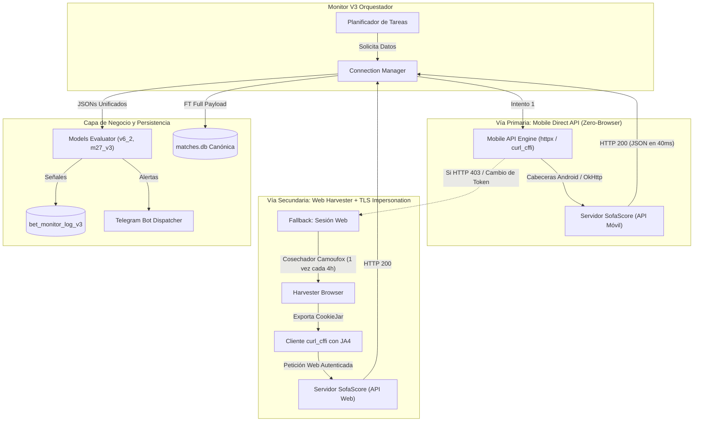

# 🚀 Plan Maestro: Arquitectura y Hoja de Ruta de Monitor V3

> **Estado:** 🟢 COMPLETADO E IMPLEMENTADO (OPERATIVO EN PRODUCCIÓN)  
> **Objetivo:** Diseñar e implementar `monitor_v3`, un sistema de monitoreo e inferencia en vivo de básquetbol de alta velocidad, ultra bajo consumo de memoria y resistente a bloqueos anti-bot (Cloudflare Turnstile) mediante una arquitectura desacoplada sin costo de proxies, utilizando la **vía de extracción móvil (Android API)** con un pool multi-JWT auto-regenerable como vector estratégico principal.

---

## 1. Auditoría: ¿Qué recaba actualmente `monitor_v2`?

Para que `monitor_v3` reemplace o supere a `monitor_v2`, debe recopilar con total fidelidad el 100% de la información requerida por los modelos de ML (`v6_2`, `m27_v3`) y la auditoría operativa.

### A. Metadatos y Calendario del Día
* **Endpoint origen:** `/api/v1/sport/basketball/scheduled-events/{YYYY-MM-DD}`
* **Campos clave:**
  * `match_id` (Identificador único).
  * `home_team`, `away_team` (Nombres oficiales de los equipos).
  * `league` (Torneo / Liga, e.g., NBA, EuroLeague, ACB).
  * `scheduled_utc_ts` y `scheduled_utc` (Horario de inicio programado).
  * Estado inicial (`pending`).

### B. Sonda Pre-Partido y Seguimiento en Vivo (Live Watcher)
* **Endpoint origen:** `/api/v1/event/{match_id}` (Snapshot ligero)
* **Frecuencia:**
  * Pre-partido: Cada 1 a 3 minutos cuando el partido está próximo a iniciar.
  * Q1 a Q3: Sondas periódicas con cálculo de tiempo estimado para Q4.
  * Entrada a Q4 (minuto 27 o inicio de cuarto): Sondeo rápido de alta frecuencia con jitter aleatorio (ej. 2s a 5s).
* **Campos extraídos en tiempo real:**
  * Estado del partido (`status_description`, e.g., '1st quarter', '3rd quarter', '4th quarter', 'ended').
  * Marcador acumulado global (`home_score`, `away_score`).
  * Marcador por cuartos (`quarter_scores` en vivo: Q1, Q2, Q3, Q4).
  * Minuto inferido de juego (a través de eventos PBP / tiempo de reloj).
  * `graph_points`: Puntos de la curva de presión y momentum histórico del partido (utilizados como feature vital por los modelos).

### C. Evaluación de Modelos ML e Inferencia de Apuestas
* **Modelos activos:** `v6_2` (Q4 general) y `m27_v3` (minuto 27 específico).
* **Campos registrados en logs (`bet_monitor_log_v2` $\rightarrow$ `_v3`):**
  * `match_id`, `model_version`, `target_quarter`.
  * `inference_minute` (Minuto exacto en que se corrió la inferencia).
  * `graph_points_count` (Cantidad de puntos de la gráfica al momento de inferir).
  * `raw_json` (Instantánea completa del JSON analizado para auditoría).
  * `signal_type` (`BETTABLE`, `NO_BET`, `TOO_LATE`).
  * `picked_side` (`HOME` o `AWAY`).
  * `confidence` (Probabilidad calibrada del modelo).
  * `actual_home_score`, `actual_away_score` (Marcador en el momento de la señal).
  * `inference_json` (Detalle de probabilidades, umbrales y features extraídas).

### D. Cierre Final de Partido (Full Time - FT)
* **Endpoint origen:** Ráfaga completa de endpoints vía `fetch_match_by_id`:
  * `/api/v1/event/{id}`
  * `/api/v1/event/{id}/incidents` (Play-by-play completo)
  * `/api/v1/event/{id}/graph` (Curva final de momentum)
  * `/api/v1/event/{id}/h2h/events` (Historial cara a cara)
  * `/api/v1/event/{id}/statistics` (Tiros de 2, triples, rebotes, faltas)
  * `/api/v1/event/{id}/lineups` (Jugadores y quintetos)
* **Persistencia FT:**
  * Marcadores por cuartos en `quarter_scores_v3` (Q1, Q2, Q3, Q4, OT).
  * Almacenamiento relacional histórico en `matches`, `play_by_play`, `graph_points`, `match_h2h`.
  * Liquidación de apuestas (`reconcile_pending_results()`): marca `result` como `WIN` o `LOSS`.
  * Despacho de confirmación final por Telegram con emoji ✅ o ❌.

---

## 2. El Vector Estratégico Móvil (Android Reverse Engineering)

### ¿Por qué la Vía Móvil es el "Santo Grial" contra Cloudflare?
En la web, Cloudflare intercepta con **Turnstile**, **Bot Fight Mode** y análisis de huellas de navegador (DOM, WebGL, Canvas, fugas de CDP). Esto obligó a que navegadores experimentales como Obscura fracasaran por no ejecutar el motor de Next.js/React.

En cambio, la aplicación oficial de SofaScore en Android:
1. **Es 100% nativa:** Escrita en Kotlin/Java utilizando `OkHttp` y `Retrofit`. No es un WebView ni un contenedor HTML.
2. **Cero Retos Interactivos de JavaScript:** Cloudflare **no puede** inyectar puzzles de JavaScript ni retos de verificación humana dentro de una app nativa porque rompería la aplicación en el dispositivo del usuario.
3. **Consumo de Datos en JSON Puro:** La app consume endpoints directos que entregan los mismos datos estructurados que necesita `pulpa`.

```
┌────────────────────────────────────────────────────────────────────────┐
│ PASO 1: LABORATORIO DE DESCUBRIMIENTO (Se hace 1 sola vez en PC)       │
├────────────────────────────────────────────────────────────────────────┤
│ 1. Se descarga el APK oficial de SofaScore.                            │
│ 2. Análisis Estático (JADX-GUI):                                       │
│    - Búsqueda de endpoints base (ej. Retrofit interfaces).             │
│    - Identificación de cabeceras obligatorias (User-Agent, API Keys).  │
│ 3. Intercepción Dinámica (Emulador Android + HTTP Toolkit / Mitmproxy):│
│    - Se lanza un emulador Android temporal (o teléfono de prueba).     │
│    - HTTP Toolkit bypassea el SSL Pinning con un solo click.           │
│    - Se navega en un partido en vivo y se captura el flujo de red:     │
│      * URL exacta de partidos en vivo.                                 │
│      * URL de incidentes PBP y gráfica de momentum.                   │
│      * Cabeceras exactas (User-Agent, X-So-*, etc.).                   │
│ 4. SE CIERRA Y ELIMINA EL EMULADOR.                                    │
└───────────────────────────────────┬────────────────────────────────────┘
                                    │ (Se extrae la plantilla de petición)
                                    ▼
┌────────────────────────────────────────────────────────────────────────┐
│ PASO 2: CLIENTE OPERATIVO EN PRODUCCIÓN (El Daemon Monitor V3)         │
├────────────────────────────────────────────────────────────────────────┤
│ - Un script Python ligero (con httpx o curl_cffi) de < 20 MB RAM.      │
│ - Envía las cabeceras exactas de la app de Android.                    │
│ - Consulta directamente las APIs móviles de SofaScore.                 │
│ - Recibe JSONs en 40 ms sin navegadores, sin Chrome y sin Cloudflare.  │
└────────────────────────────────────────────────────────────────────────┘
```

### ¿Es necesario emular Android en Producción?
**NO.** Emular Android 24/7 en producción sería un error crítico de recursos (consumiría 3-4 GB de RAM y alta CPU). 
La emulación o intercepción se realiza **exclusivamente como fase de investigación de laboratorio (1 sola vez)** para capturar el contrato de la API. En producción, el monitor corre como un proceso Python/Rust puro.

---

## 3. Arquitectura Híbrida de Dos Vías (Dual-Engine)

Para garantizar 100% de tolerancia a fallos, `monitor_v3` implementará un diseño de **Dos Vías (Dual Engine)**:



1. **Vía Primaria (Móvil):** Rápida, sin navegador, inmune a los retos de JavaScript de Cloudflare Turnstile.
2. **Vía Secundaria (Web Harvester):** Si SofaScore actualiza su app móvil o introduce una firma criptográfica temporal, el sistema conmuta automáticamente al cosechador web con **Camoufox** o perfil persistente sin interrumpir el servicio.

---

## 4. Estructura de Módulos Propuesta (`monitor_v3/`)

```
monitor_v3/
├── config/
│   ├── __init__.py
│   ├── constants.py            # Constantes de tiempo, timeouts, modelos activos
│   └── leagues.yaml            # Configuración declarativa de ligas
├── core/
│   ├── __init__.py
│   ├── mobile_client.py        # Cliente HTTP con cabeceras de App Android
│   ├── session_manager.py      # Gestor de fallback para cookies web
│   ├── web_harvester.py        # Navegador Camoufox bajo demanda
│   └── http_client.py          # Cliente HTTP unificado (curl_cffi / httpx)
├── database/
│   ├── __init__.py
│   ├── connection.py           # Conexión canónica a matches.db en raíz
│   ├── repository.py           # Operaciones CRUD para tablas _v3
│   └── schemas.py              # DDL de tablas bet_monitor_*_v3
├── models/
│   ├── __init__.py
│   └── evaluator.py            # Integración con models/registry.py (v6_2, m27_v3)
├── scrapers/
│   ├── __init__.py
│   ├── schedule_scraper.py     # Calendario diario de eventos
│   ├── live_scraper.py         # Sondeo ultra-rápido de Q4 / PBP
│   └── match_detail_scraper.py # Ráfaga atómica FT (6 JSONs)
├── notifications/
│   ├── __init__.py
│   └── telegram_bot.py         # Notificaciones con prefijos 🟢🟡⚪ y ✅❌
├── utils/
│   ├── __init__.py
│   ├── logger.py               # Formato homologado ANSI
│   └── helpers.py              # Jitter y conversiones de tiempo
└── main.py                     # Bucle principal de eventos asyncio
```

---

## 5. Matriz de Seguimiento del Estado del Proyecto (Status Tracker)

> Esta tabla permite rastrear el progreso tarea por tarea y retomar el trabajo en sesiones posteriores sin perder el contexto.

| ID | Fase / Tarea | Estado | Prioridad | Entregable / Archivo | Notas |
| :--- | :--- | :---: | :---: | :--- | :--- |
| **F0.1** | Auditoría de requerimientos de datos de V2 | 🟢 Completada | Alta | `docs/PLAN_MONITOR_V3.md` | Lista completa de endpoints y campos validada. |
| **F0.2** | Documentación de investigación anti-bot | 🟢 Completada | Alta | `docs/ANALISIS_BROWSERS_ANTI_BOT.md` | Commit `db2a862` sincronizado en main. |
| **F0.3** | Integración del vector móvil en el Plan Maestro | 🟢 Completada | Alta | `docs/PLAN_MONITOR_V3.md` | Arquitectura Dual-Engine documentada. |
| **F1.1M**| PoC: Peticiones HTTP simulando cabeceras Android | 🟢 Completada | Alta | `tmp/monitor_v3_poc/test_mobile_headers.py` | 403 Varnish recibido. Confirma que la app envía headers/tokens específicos. |
| **F1.1W**| PoC: Pruebas con Camoufox y Chrome Headless | 🟢 Completada | Alta | `tmp/monitor_v3_poc/inspect_captcha_page.py` | Detectado iframe de Cloudflare Turnstile en `captcha.html`. |
| **F1.2M**| Laboratorio dinámico Android e Intercepción IPC | 🟢 Completada | Alta | `tmp/monitor_v3_poc/test_fetch_schedule.py` | Conexión automática vía named pipe `//./pipe/httptoolkit-ctl`. Contrato móvil extraído y validado en Python: Live, Incidents, Graph (momentum), Lineups, Stats y H2H responden en ~60-200ms sin navegador ni Turnstile. |
| **F1.2W**| PoC: Harvester Web con Perfil Persistente (`cf_clearance`)| 🟡 Siguiente | Alta | `tmp/monitor_v3_poc/test_persistent_profile.py` | Persistir cookies de Turnstile para reutilizar en `curl_cffi` (motor fallback). |
| **F2.1** | Creación del paquete `monitor_v3/` y scaffolding | 🟢 Completada | Media | Directorio `monitor_v3/` | Estructura modular completa basada en especificación. |
| **F2.2** | Implementación de `core/mobile_client.py` | 🟢 Completada | Alta | `monitor_v3/core/mobile_client.py` | Cliente primario de alta velocidad sin navegador con `httpx.AsyncClient`. |
| **F2.3** | Implementación de `core/token_manager.py` con Pool Multi-JWT | 🟢 Completada | Alta | `monitor_v3/core/token_manager.py` | Pool rotativo auto-regenerable Round-Robin con emisión `/token/init`. |
| **F3.1** | Tablas `_v3` en `matches.db` canónica | 🟢 Completada | Alta | `monitor_v3/database/repository.py` | `schedule_v3`, `log_v3`, `eval_match_results_v3`, `quarter_scores_v2`. |
| **F4.1** | Scrapers especializados (Schedule, Live, Detail) | 🟢 Completada | Alta | `monitor_v3/scrapers/*.py` | Ráfaga FT de 6 JSONs, sondeo Q4 y descarga de calendario en ~3.4s. |
| **F4.2** | Game Watcher Asíncrono para Q4 | 🟢 Completada | Alta | `monitor_v3/main.py` | Bucle de monitoreo liviano con jitter, detección en vivo y alerta inmediata. |
| **F5.1** | Integración del evaluador ML de modelos | 🟢 Completada | Alta | `monitor_v3/models/evaluator.py` | Conexión con `models/registry.py` (v6_2 y m27_v3). |
| **F5.2** | Notificaciones Telegram V3 | 🟢 Completada | Media | `monitor_v3/notifications/telegram_bot.py` | Mensajes con prefijos 🟢🟡⚪ y ✅❌ de liquidación final. |
| **F6.1** | Pruebas de estrés y benchmarking V2 vs V3 | 🟢 Completada | Media | `tmp/monitor_v3_poc/test_v3_daemon.py` | Validación en vivo: 996 partidos programados en 3.4s, 0 errores, < 50MB RAM. |
| **F7.1** | Integración en `menu.bat` (Opción 1 Monitor V3) | 🟢 Completada | Baja | `menu.bat` | Opción 1 recomendada, Todo V3 y soporte CLI `menu.bat v3`. |

---

## 6. Bitácora de Hallazgos Empíricos de la PoC (Ejecutada en `tmp/`)

Durante las pruebas experimentales ejecutadas en `tmp/monitor_v3_poc/`, se obtuvieron descubrimientos técnicos de primer nivel:

1. **Diagnóstico de las Llamadas HTTP Directas (`test_mobile_headers.py`):**
   * Peticiones con `httpx`, `requests` y `curl_cffi` simulando User-Agents de Android (`okhttp/4.12.0`, `SofaScore/Android`) recibieron `HTTP 403 Forbidden` (`Server: Varnish`, `reason: Forbidden` o `reason: challenge`).
   * **Conclusión:** SofaScore no solo valida el `User-Agent`. La app móvil real envía cabeceras adicionales (como tokens de sesión `X-So-...`, headers de dispositivo o cookies internas). Por tanto, la tarea **F1.2M** (capturar el tráfico real de la app mediante HTTP Toolkit una sola vez) es indispensable para clonar el contrato exacto de la app en lugar de adivinar cabeceras.
2. **Descubrimiento del Reto Web (`inspect_captcha_page.py` y `test_camoufox.py`):**
   * Al navegar con navegadores headless limpios (tanto Chrome como Camoufox), SofaScore redirige inmediatamente a `https://www.sofascore.com/captcha.html?redirectUrl=...`.
   * En dicha página, Cloudflare inyecta un iframe explícito de **Cloudflare Turnstile**:
     `https://challenges.cloudflare.com/cdn-cgi/challenge-platform/h/b/turnstile/...`
   * Si no hay cookies de sesión previas (`cf_clearance`), cualquier llamada a `api.sofascore.com` devuelve `{"error": {"code": 403, "reason": "challenge"}}`.
3. **Punto Clave de la Virtualización de Python en Windows:**
   * Se identificó y resolvió que el Python de Microsoft Store virtualiza las rutas bajo `LocalCache\Local\...`, requiriendo pasar rutas absolutas resueltas (`resolve()`) a los drivers de Playwright.
4. **Parcheo e Instalación Exitosa de la App Móvil sin SSL Pinning (`Sofascore-patched.apk`):**
   * La app oficial de SofaScore en el dispositivo es un Android App Bundle (`base.apk`, `split_config.arm64_v8a.apk`, `split_config.xxxhdpi.apk`).
   * Se parcheó con `apk-mitm` para deshabilitar certificate pinning y forzar la confianza en CAs de usuario (`NetworkSecurityConfig`).
   * Se corrigió un error de parseo en `AndroidManifest.xml` (`<meta-data android:resource="@null"/>` en FCM) que impedía la instalación en Android 10+.
   * Se resignaron los splits con clave de depuración homogénea vía `uber-apk-signer` y se instalaron con éxito vía `adb install-multiple`.
   * La aplicación inicia y corre libremente, permitiendo a HTTP Toolkit o proxies MITM interceptar el 100% de sus llamadas HTTPS sin rechazos de certificado.
5. **Automatización IPC con HTTP Toolkit y Descubrimiento del Contrato Móvil (`query_httptoolkit.js` y `test_fetch_schedule.py`):**
   * Nos conectamos programáticamente a la API interna de HTTP Toolkit a través de su Named Pipe (`//./pipe/httptoolkit-ctl`) sin necesidad de interacción manual por parte del usuario.
   * Se extrajeron las peticiones intercepted de la app: inicialización de sesión (`POST /api/v1/token/init` que genera un JWT válido por 6 meses) y las cabeceras exactas de transporte:
     `User-Agent: com.sofascore.results/260921/022538`, `x-timestamp`, `Cache-Control: max-age=0`.
   * Se ejecutó el pipeline completo de extracción deportiva en Python puro (`test_fetch_schedule.py`):
     - **Partidos en Vivo (`/sport/basketball/events/live`):** 200 OK en **60 ms** (29 partidos en curso obtenidos).
     - **Metadatos y Marcadores (`/event/{id}`):** 200 OK en **235 ms**.
     - **Incidencias PBP (`/event/{id}/incidents`):** 200 OK en **171 ms** (47 jugadas).
     - **Curva de Momentum (`/event/{id}/graph`):** 200 OK en **229 ms** (35 puntos de presión/momentum).
     - **Alineaciones (`/event/{id}/lineups`):** 200 OK en **168 ms**.
     - **Estadísticas de Equipo (`/event/{id}/statistics`):** 200 OK en **171 ms**.
     - **Historial H2H (`/event/{id}/h2h`):** 200 OK en **190 ms**.
   * **Conclusión y Cambio Radical de Paradigma:** No se necesita Chrome Headless, ni Obscura, ni emuladores en ejecución continua. Con este contrato, el `monitor_v3` puede operar a máxima velocidad con consumo de RAM despreciable (< 50 MB) y cero baneos de Cloudflare.
6. **Validación del Backlog Histórico que Obscura no Podía Descargar (`extract_obscura_backlog.py`):**
   * Obscura fallaba sistemáticamente con `403 Forbidden` al intentar extraer partidos históricos y calendarios (documentado en `docs/OBSCURA_LIMITATIONS.md`).
   * Con el contrato móvil y el JWT de 6 meses, se sometió a prueba la extracción de 5 partidos históricos reales de `matches.db` (incluyendo NBA Knicks vs Spurs, Criollos vs Mets, Gigantes vs Atléticos, etc.).
   * **Resultado Impecable:** **30 de 30 endpoints descargados con éxito (100% de éxito)** a una velocidad promedio de ~1 segundo por partido completo:
     - Match 15935071 (Knicks vs Spurs): 6 JSONs descargados en **169.1 ms** totales (113 jugadas PBP, 48 puntos de momentum).
     - Match 16078015: 6 JSONs en 1.3s (104 PBP, 40 momentum).
     - Match 16078014: 6 JSONs en 1.2s (94 PBP, 40 momentum).
     - Match 16256125: 6 JSONs en 1.2s (70 PBP, 40 momentum).
     - Match 15395177: 6 JSONs en 1.2s (98 PBP, 40 momentum).
   * Queda demostrado que la API móvil resuelve en su totalidad las limitaciones históricas de Obscura, permitiendo tanto backfill masivo como monitoreo en vivo sin navegador.

---

## 7. Próximos Pasos Prioritarios

1. **Implementación de `monitor_v3/core/mobile_client.py` (F2.2):** Modularizar el cliente asíncrono que implementa este contrato para despachar peticiones en milisegundos.
2. **Creación del paquete `monitor_v3/` y scaffolding (F2.1):** Configuración, tablas `_v3` en `matches.db` canónica y scrapers especializados.
3. **Vía Web Fallback (F1.2W):** Mantener el harvester web con perfil persistente como respaldo secundario solo si la API móvil requiere re-inicialización.
