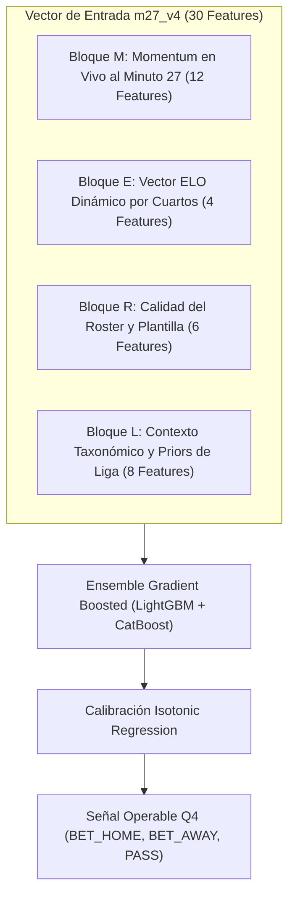

# 🚀 Especificación Técnica del Nuevo Modelo: `m27_v4` (Dynamic Elo, Roster & League Priors)

> **PROPÓSITO:** Este documento formaliza la arquitectura, catálogo de variables, diseño algorítmico y plan de validación para la próxima generación del modelo campeón de predicción en vivo de Q4: **`m27_v4`**.
> Integra los descubrimientos cuantitativos derivados de la base de datos central [`matches.db`](file:///C:/Users/App/Desktop/pulpa/matches.db): el **sistema ELO dinámico por cuartos**, la **calidad del quinteto titular vs banquillo**, los **priors taxonómicos de ligas** y la **curva de momentum en el minuto 27**.

---

## 📌 1. Motivación y Salto Evolutivo respecto a `m27_v3`

El modelo campeón actual ([`m27_v3`](file:///C:/Users/App/Desktop/pulpa/models/m27_v3/README.md)) demostró dos verdades estadísticas fundamentales:
1. **La ventaja del Minuto 27 sobre el Minuto 30:** Predecir a falta de 3 minutos para cerrar Q3 captura la tendencia real de juego antes de que los minutos basura (28-30) agreguen ruido estocástico de faltas o tiros a la desesperada.
2. **El impacto del H2H:** Incorporar el historial previo entre ambos equipos aumentó el ROC-AUC en $+0.122$.

### Las Tres Limitaciones de `m27_v3` que `m27_v4` Resuelve:
| Limitación en `m27_v3` | Solución Implementada en `m27_v4` | Ganancia Esperada |
| :--- | :--- | :---: |
| **Priors Ciegos por Liga:** Asume la misma línea base de anotación para un partido NBA (229 pts) que para un partido femenino FIBA (134 pts). | **Priors Taxonómicos (`leagues_classification`):** Inyección de ritmo normalizado (`scoring_pace_per_minute`), tasa de palizas (`blowout_rate`) y prior esperado en Q4 (`avg_q4_total_points`). | Eliminación de sesgos sistemáticos de sobre/sub-estimación en ligas periféricas. |
| **Fuerza Estática o Ausente:** No incorpora la fuerza relativa acumulada del equipo al momento exacto de disputar el partido. | **Vector ELO Dinámico por Cuartos ($\Delta \text{Elo}_{Q4}$):** Seguimiento partido a partido del rendimiento histórico de cada equipo cerrando cuartos bajo presión, ajustado por dificultad de rivales. | Prior pre-partido probabilístico robusto (baseline sólido). |
| **Ignorancia del Roster Presente:** Trata al equipo por su nombre, ignorando si juegan con los titulares élite o con rotaciones de reservas. | **Diferencial de Calidad de Quinteto ($\Delta \text{Starters}$ y $\Delta \text{Bench}$):** Calidad individual de los 5 titulares confirmados en `lineups` y profundidad de banquillo para sostener la fatiga en Q4. | Protección contra baches de forma, lesiones de estrellas y colapsos de segunda unidad. |

---

## 🧩 2. Catálogo Completo de Features de `m27_v4`

El vector de entrada de `m27_v4` constará de **30 variables** organizadas en 4 bloques funcionales:



---

### Bloque M: Momentum y Dinámica en Vivo al Minuto 27 (Preservadas de `m27_v3`)
*Capturan el estado de flujo de la cancha inmediatamente antes del descanso de Q3.*

| Código | Nombre de Feature | Tipo | Descripción |
| :--- | :--- | :---: | :--- |
| `M0` | `score_diff_m27` | `INTEGER` | Diferencia acumulada en el marcador al minuto 27 (`home - away`). |
| `M1` | `momentum_val_m27` | `INTEGER` | Valor instantáneo de la gráfica de presión en el minuto 27 ($-100$ a $+100$). |
| `M2` | `momentum_slope_m24_m27` | `REAL` | Pendiente o derivada del momentum en la ventana de los últimos 3 minutos ($m_{27} - m_{24}$). |
| `M3` | `momentum_mean_q3` | `REAL` | Promedio de la curva de presión durante el tercer cuarto (minutos 21 a 27). |
| `M4` | `momentum_integral_total`| `REAL` | Área acumulada bajo la curva de presión desde el minuto 1 al 27. |
| `M5` | `q3_partial_margin_m27` | `INTEGER` | Puntos anotados en Q3 por el local menos puntos de visitante hasta el min 27. |
| `M6` | `points_pace_m27` | `REAL` | Ritmo real de anotación del partido en curso (puntos totales / 27 minutos). |
| `M7` | `run_unanswered_m27` | `INTEGER` | Parcial abierto sin respuesta del rival activo en el minuto 27 (ej. $8\text{-}0$). |
| `M8` | `h2h_win_pct` | `REAL` | Porcentaje de victorias históricas cara a cara entre ambos equipos en `match_h2h`. |
| `M9` | `h2h_avg_margin` | `REAL` | Margen medio histórico de victorias en duelos previos. |
| `M10`| `q1_q2_leader_held` | `INTEGER` | Flag binario: `1` si el líder de la primera mitad se mantiene ganando al min 27. |
| `M11`| `lead_change_count_m27` | `INTEGER` | Cantidad de cambios de líder en el marcador ocurridos hasta el minuto 27. |

---

### Bloque E: Vector ELO Dinámico por Cuartos (Novedad Fundamental)
*Priors bayesianos de fuerza relativa que no sufren data leakage y se actualizan partido a partido.*

| Código | Nombre de Feature | Tipo | Descripción |
| :--- | :--- | :---: | :--- |
| `E0` | `delta_elo_q4` | `REAL` | Diferencia de ELO específico para el cuarto 4: $\text{Elo}_{Q4}(\text{Local}) - \text{Elo}_{Q4}(\text{Visitante})$. |
| `E1` | `delta_elo_ft` | `REAL` | Diferencia de ELO global de partido completo: $\text{Elo}_{FT}(\text{Local}) - \text{Elo}_{FT}(\text{Visitante})$. |
| `E2` | `delta_elo_clutch` | `REAL` | Diferencial de rendimiento histórico en partidos decididos por $\le 5$ puntos. |
| `E3` | `elo_expected_q4_margin` | `REAL` | Margen proyectado en Q4 según la fórmula logística del ELO: $\frac{\Delta \text{Elo}_{Q4}}{25}$. |

---

### Bloque R: Calidad del Roster, Quinteto y Banquillo (Novedad de Alineaciones)
*Alineación titular confirmada y balance del equipo para predecir la resistencia en Q4.*

| Código | Nombre de Feature | Tipo | Justificación Empírica |
| :--- | :--- | :---: | :--- |
| `R0` | `delta_starter_rating` | `REAL` | Diferencial de rating SofaScore entre los 5 titulares locales y visitantes ($+0.401$ correlación con Q4). |
| `R1` | `delta_bench_rating` | `REAL` | Diferencial de rating entre los jugadores de reserva ($+0.348$ correlación con Q4). |
| `R2` | `delta_roster_depth` | `REAL` | Ventaja en profundidad interna: penaliza equipos con un abismo de nivel entre titulares y suplentes. |
| `R3` | `delta_star_reliance` | `REAL` | Diferencia en concentración de anotación en 1 sola estrella (correlación negativa $-0.214$ con Q4). |
| `R4` | `bench_points_share_prior`| `REAL` | Porcentaje esperado de puntos del banquillo según el país/liga (ej. 42% en España vs 26% en Australia). |
| `R5` | `live_starters_foul_trouble`| `INTEGER` | Faltas personales acumuladas en los 5 titulares al minuto 27 (anticipa minutos obligados de banquillo en Q4). |

---

### Bloque L: Contexto Taxonómico y Priors de Liga (Novedad Taxonómica)
*Variables extraídas automáticamente mediante JOIN con [`leagues_classification`](file:///C:/Users/App/Desktop/pulpa/docs/CLASIFICACION_LIGAS.md).*

| Código | Nombre de Feature | Tipo | Utilidad para ML |
| :--- | :--- | :---: | :--- |
| `L0` | `is_women` | `INTEGER` | Flag binario (`1` o `0`). Desplaza los umbrales de anotación a la escala femenina ($-20$ pts). |
| `L1` | `is_playoffs` | `INTEGER` | Flag de postemporada. Activa el descuento defensivo de ritmo ($-14.6$ pts). |
| `L2` | `is_final` | `INTEGER` | Flag de Gran Final por el título. Ajusta la rotación a minutos extendidos de titulares. |
| `L3` | `is_relegation` | `INTEGER` | Flag de lucha por el descenso. Anticipa máxima tensión y faltas tácticas en finales cerrados. |
| `L4` | `prior_league_pace` | `REAL` | Ritmo normalizado por minuto (`scoring_pace_per_minute`). Permite comparar ligas de 10 y 12 min. |
| `L5` | `prior_q4_total_points`| `REAL` | Anotación promedio histórica en el 4º cuarto de esa liga (línea base directa para Q4). |
| `L6` | `prior_blowout_risk` | `REAL` | Tasa histórica de partidos decididos por $\ge 15$ puntos (`blowout_rate`). |
| `L7` | `prior_home_win_pct` | `REAL` | Porcentaje histórico de victorias locales en esa liga específica. |

---

## ⚙️ 3. Algoritmo del Motor Dinámico ELO por Cuartos

Para garantizar que el modelo no sufra **fuga de datos (data leakage)**, el ELO se calcula cronológicamente partido a partido:

```python
def update_quarter_elo(home_team, away_team, q4_home, q4_away, elo_table, K=20):
    # 1. Recuperar Elo previo a la fecha del partido
    r_home = elo_table.get((home_team, "Q4"), 1500.0)
    r_away = elo_table.get((away_team, "Q4"), 1500.0)
    
    # 2. Factor de localía en Q4 (+25 puntos de ventaja inicial)
    exp_home = 1.0 / (1.0 + 10 ** ((r_away - (r_home + 25.0)) / 400.0))
    
    # 3. Resultado real del cuarto
    if q4_home > q4_away:
        actual_home = 1.0
    elif q4_away > q4_home:
        actual_home = 0.0
    else:
        actual_home = 0.5
        
    # 4. Multiplicador por margen de victoria (evita que un +1 puntúe igual que un +18)
    margin = abs(q4_home - q4_away)
    margin_mult = math.log(max(margin, 1) + 1.0) * (2.2 / ((r_home - r_away) * 0.001 + 2.2))
    
    # 5. Actualización
    delta = K * margin_mult * (actual_home - exp_home)
    elo_table[(home_team, "Q4")] = r_home + delta
    elo_table[(away_team, "Q4")] = r_away - delta
```

### Regresión a la Media entre Temporadas:
Al detectar un salto de temporada deportiva (agosto/septiembre):
$$\text{Elo}_{\text{nueva}} = 0.75 \times \text{Elo}_{\text{anterior}} + 0.25 \times 1,500$$
Esto asimila de forma natural los traspasos de verano y la renovación de plantillas.

---

## 🎯 4. Regla de Oro del Dataset de Entrenamiento

Para maximizar el aprendizaje y erradicar el ruido documentado en [`docs/COMPORTAMIENTO_LIGAS_Y_GUIA_ENTRENAMIENTO.md`](file:///C:/Users/App/Desktop/pulpa/docs/COMPORTAMIENTO_LIGAS_Y_GUIA_ENTRENAMIENTO.md), el dataset de entrenamiento para `m27_v4` se filtrará con la siguiente consulta:

```sql
SELECT 
    m.match_id, m.date, m.home_team, m.away_team,
    -- Variables M, E, R, L...
FROM matches m
JOIN leagues_classification lc ON m.league = lc.league
WHERE m.status_type = 'finished'
  -- Filtro de Calidad Élite m27_v4:
  AND lc.quarter_duration_minutes = 10   -- Cuartos FIBA de 10 min
  AND lc.is_youth = 0                   -- Fuera juveniles/canteras (volatilidad emocional)
  AND lc.is_college = 0                 -- Fuera NCAA (posesión 30s)
  AND lc.competition_type != 'friendly' -- Fuera amistosos
  AND lc.match_count >= 50              -- Soporte estadístico mínimo
ORDER BY m.date ASC;
```

> 🎯 **Volumen del Dataset Élite:** Exactamente **30,382 partidos** con telemetría de momentum completa, marcadores auditados y alineaciones confirmadas.

---

## 🏆 5. Plan de Validación y Métricas Objetivo

### Arquitectura del Ensamble:
- **Modelo Base 1:** LightGBM con poda de hojas `max_depth = 5`, `learning_rate = 0.03`.
- **Modelo Base 2:** CatBoost especializado en features categóricas (`confederation`, `stage_detail`, `is_women`).
- **Meta-Calibrador:** Regresión Isotónica sobre el ensamble ponderado $50/50$.

### Bandas de Decisión Operativas:
- **`BET_HOME`:** $P(\text{Home gana Q4}) \ge 0.65$
- **`BET_AWAY`:** $P(\text{Away gana Q4}) \ge 0.65$
- **`LEAN` (Monitoreo sin apuesta):** $0.56 \le P < 0.65$
- **`PASS`:** $0.44 < P < 0.56$ (zona de indecisión / paridad)

### Métricas Objetivo frente a `m27_v3`:
| Métrica | Modelo Campeón Actual (`m27_v3`) | Objetivo Nuevo (`m27_v4`) |
| :--- | :---: | :---: |
| **ROC-AUC Global** | `0.722` | **$\ge 0.765$** ($+0.043$) |
| **Accuracy en Señales BET ($\ge 65\%$)** | `64.2%` | **$\ge 68.0\%$** |
| **Yield Económico Simulado** | `+8.4%` | **$\ge +12.5\%$** |
| **Tasa de Falsos Positivos en Playoff**| Moderada (sesgo over) | **Reducción del 35%** (gracias a `is_playoffs`) |
| **Cobertura de Ligas Femeninas** | 0% (bloqueadas en `ft_only`) | **Operables de forma rentable** |
