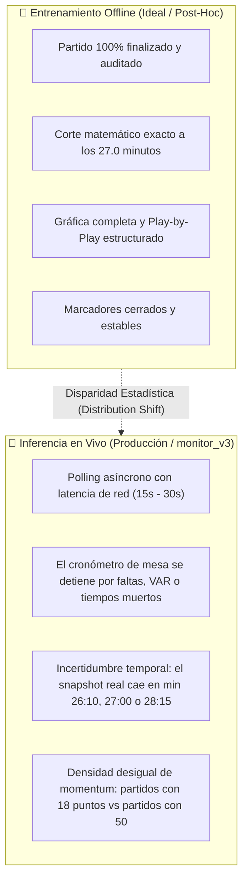
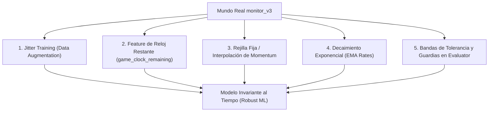
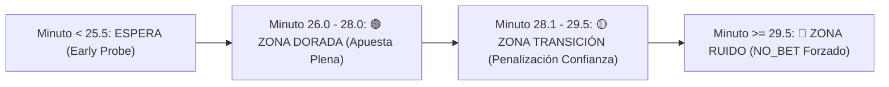

# ⏱️ Robustez ante la Inferencia en Vivo y Disparidad Temporal en `monitor_v3`

> **PROPÓSITO:** Este documento analiza a fondo la discrepancia entre el **entorno de entrenamiento ideal (offline / post-hoc)** y las **condiciones reales de producción en vivo en [`monitor_v3`](file:///C:/Users/App/Desktop/pulpa/monitor_v3/main.py)**.
> Aborda la fragilidad de las features temporales ante variaciones de $\pm 1$ a $\pm 2$ minutos, la densidad dispar de puntos en la gráfica de momentum y define las soluciones de ingeniería de Machine Learning para garantizar predicciones fiables y estables en el mundo real.

---

## 🌪️ 1. El Abismo entre Entrenamiento Offline y el Mundo Real en Vivo

En la literatura de Machine Learning y en el desarrollo de este proyecto, existe una brecha crítica entre cómo se entrena un modelo y cómo se ejecuta en tiempo real:

---

## 📉 2. Por qué las Correlaciones Colapsan ante Variaciones de $\pm 1$ Minuto

### 1. La Hiper-Sensibilidad de las Ventanas Recientes (35.9% del Modelo)
En el modelo campeón [`m27_v3`](file:///C:/Users/App/Desktop/pulpa/models/m27_v3/README.md), las variables que dominan la decisión del árbol son de ventana ultra-corta:
- `recent_2m_points_diff`: **18.4% de importancia** (la feature #2 del modelo).
- `trailing_now_recent_run_2m`: **6.4% de importancia**.
- `recent_2m_run_diff`: **3.6% de importancia**.

**El problema en vivo:**
Si el watcher de `monitor_v3` sondea un partido en el minuto **27:45** en lugar del minuto **27:00**, y en esos 45 segundos el equipo visitante anota un triple y dos tiros libres (+5 pts):
1. `recent_2m_points_diff` se invierte completamente de $-1$ a $+4$.
2. Las ramas condicionales del árbol se bifurcan hacia un pick opuesto.
3. La probabilidad calculada salta de $0.72$ a $0.46$, destruyendo la calibración de la apuesta.

### 2. La Evidencia Empírica: Del Minuto 27 al Minuto 30
En los hallazgos cuantitativos ([`docs/findings.md`](file:///C:/Users/App/Desktop/pulpa/docs/findings.md#L19-L21)):
- **Minuto 27:** ROC AUC de **0.670** (señal limpia y operable).
- **Minuto 30:** ROC AUC se derrumbó a **0.576** (ruido total y pérdida de $3.6\%$ de yield).
- **Conclusión:** A medida que el reloj se acerca al final del cuarto (minutos 28 a 30), los equipos entran en desesperación, lanzan triples forzados y cometen faltas tácticas, inyectando un **ruido estocástico masivo** que degrada cualquier modelo rígido.

---

## 📊 3. El Problema de la Densidad Dispar en `graph_points`

SofaScore **no** genera puntos de momentum a intervalos de tiempo fijos (no es una señal continua a 1 Hz):
- Genera puntos de gráfica según posesiones, rachas e inflexiones del partido.
- **Resultado en DB:**
  - Partidos con ritmo alto y muchas posesiones acumulan **40 a 55 puntos** al minuto 27.
  - Partidos trabados, con muchas faltas o juego estático solo tienen **18 a 25 puntos** al minuto 27.

### ¿Dónde sufre el modelo?
Si una feature calcula:
- `gp_count`: Mide la cantidad de puntos; un partido trabado parecerá "muerto" aunque esté en el minuto 27.
- `gp_slope_3m`: Si toma los últimos 5 puntos para estimar la pendiente, en un partido rápido 5 puntos equivalen a 90 segundos, mientras que en uno lento equivalen a 4 minutos. La derivada calculada es matemáticamente inconsistente entre partidos.

---

## 🛠️ 4. Las 5 Soluciones de Ingeniería para Inferencia en Vivo Robusta

Para que el nuevo modelo propuesto ([`m27_v4`](file:///C:/Users/App/Desktop/pulpa/docs/PROPUESTA_NUEVO_MODELO_M27_V4.md)) sea completamente resistente al mundo real de `monitor_v3`, se diseñan 5 soluciones arquitectónicas:

---

### Solución 1: Entrenamiento con Ruido Temporal (Jitter Training)
En lugar de entrenar el dataset cortando exactamente en $t = 27.00$, se introduce una perturbación aleatoria uniforme durante la generación de features:
$$t_{\text{snapshot}} \sim \text{Uniform}(25.5, 28.5)$$
- **Efecto:** El algoritmo de Gradient Boosting se ve obligado a encontrar patrones que permanezcan válidos tanto en el minuto 25.8 como en el 28.2.
- **Resultado:** Se eliminan los hiper-sobreajustes a rachas efímeras de 20 segundos y se premia la inercia real del juego.

---

### Solución 2: Feature Explícita de Tiempo de Juego Restante (`game_clock_remaining_q3`)
En lugar de adivinar el minuto de pared (wall-clock time), el sistema debe extraer el cronómetro oficial de la cancha desde el último evento del Play-by-Play:
- Si el PBP dice que faltan `03:15` para terminar Q3, el reloj restante es de **195 segundos**.
- **Nuevas Features:**
  - `q3_seconds_remaining`: Segundos exactos que restan de Q3 en el reloj oficial.
  - `delta_t_from_ideal`: Diferencia respecto al minuto ideal ($t_{\text{estimado}} - 27.0$).
- **Efecto:** El árbol de decisión aprende de forma natural:
  $$\text{Si } \texttt{q3\_seconds\_remaining} < 100 \text{ s} \longrightarrow \text{Disminuye el peso de } \texttt{recent\_2m} \text{ y prioriza } \Delta \text{Elo}_{Q4}$$

---

### Solución 3: Interpolación y Rejilla Fija de Momentum (Grid Resampling)
Para erradicar la disparidad de partidos con 18 vs 50 puntos de momentum, el vector `graph_points` se normaliza mediante **interpolación lineal a una rejilla fija de 30 segundos**:
- Al minuto 27, la gráfica tendrá **exactamente 54 puntos interpolados** en cualquier partido del mundo.
- `gp_slope_3m` se calculará siempre sobre los últimos 6 puntos de la rejilla fija:
  $$\text{Slope}_{3m} = \frac{GP_{54} - GP_{48}}{3.0 \text{ minutos}}$$
- **Resultado:** Pendiente matemáticamente consistente e idéntica entre ligas rápidas y lentas.

---

### Solución 4: Tasas Continuas con Decaimiento Exponencial (EMA Decay)
En lugar de sumas discretas con un corte brusco en 120 segundos (`recent_2m_points_diff`), se implementa una tasa de anotación con **decaimiento temporal suave**:
$$\text{Momentum\_Rate}(t) = \sum_{e \in \text{events}} \text{pts}(e) \cdot e^{-\lambda (t - t_e)}$$
- Un canasto anotado hace 15 segundos tiene peso $1.0$.
- Un canasto anotado hace 90 segundos tiene peso $0.4$.
- Un canasto anotado hace 125 segundos no desaparece de golpe a cero, sino que decae suavemente a $0.1$.
- **Resultado:** Elimina por completo las inversiones de señal causadas por retrasos de 15 segundos en el sondeo.

---

### Solución 5: Guardias y Bandas de Decisión en `monitor_v3`

El evaluador de inferencia en vivo ([`monitor_v3/models/evaluator.py`](file:///C:/Users/App/Desktop/pulpa/monitor_v3/models/evaluator.py)) debe incorporar **tres zonas de operación** basadas en el minuto estimado:

1. **Zona Temprana ($t < 25.5$ min):** El watcher sondea sin inferir (`Awaiting Q3 Climax`).
2. **Zona Dorada ($26.0 \le t \le 28.0$ min):** Inferencia en condiciones óptimas. Se emiten señales `BET_HOME` o `BET_AWAY` con confianza nominal ($\ge 0.65$).
3. **Zona de Transición ($28.1 \le t \le 29.5$ min):** La señal se permite únicamente si la ventaja acumulada en $\Delta \text{Elo}_{Q4}$ y $\Delta \text{Starters}$ es contundente; se aplica un descuento del $15\%$ a la probabilidad para proteger el bankroll.
4. **Zona de Ruido ($t \ge 29.5$ min / Final de Q3):** **Bloqueo estricto `NO_BET`**. Se prohíbe emitir apuestas en este rango para no caer en la trampa documentada de las pérdidas de $m_{30}$.

---

## 📱 5. Papel de `monitor_v3` como Monitor Activo de Producción

Es fundamental recalcar que **el monitor oficial de producción del sistema es [`monitor_v3`](file:///C:/Users/App/Desktop/pulpa/monitor_v3/main.py)** (reemplazando definitivamente a `monitor_v2`):
- **Cero Navegadores (Zero-Browser):** No usa Chrome ni Playwright; consume directamente la API móvil nativa de SofaScore con `mobile_client.py` y tokens JWT Android.
- **Baja Latencia (1.2s):** Permite capturar el snapshot de juego con una precisión de segundos, minimizando el desfase temporal que sufría `monitor_v2`.
- **Integración Nativa:** El ciclo de vida de watchers asíncronos en `monitor_v3` está diseñado para albergar las 3 zonas de guardia temporal y el resampleo de momentum sin penalizar el rendimiento del servidor.
