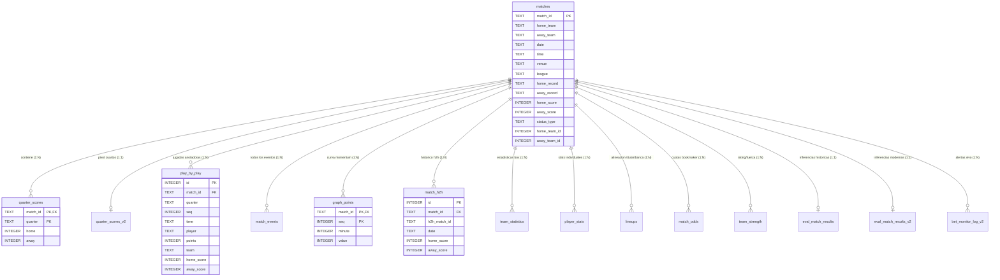

# 🗄️ Especificación del Esquema de Base de Datos (`matches.db`)

> **PROPÓSITO:** Este documento proporciona la especificación técnica exhaustiva y formal del esquema relacional de la base de datos central `matches.db` (~737 MB, SQLite 3 con modo WAL).
> Está diseñado tanto para **lectura humana** (ingenieros de datos, analistas de EDA y machine learning) como para **comprensión estricta por agentes de IA**, garantizando que cualquier consulta analítica, cruce relacional o extracción de features se realice sin ambigüedades ni riesgo de *data leakage*.

---

## 🧭 Ubicación y Reglas Canónicas
- **Ruta Canónica:** Estrictamente en la raíz del proyecto: [`matches.db`](file:///C:/Users/App/Desktop/pulpa/matches.db).
- **Código de Definición y Migraciones:** [`match/db.py`](file:///C:/Users/App/Desktop/pulpa/match/db.py#L32-L135) y [`monitor_v2/database/repository.py`](file:///C:/Users/App/Desktop/pulpa/monitor_v2/database/repository.py#L35-L130).
- **Estado WAL:** `PRAGMA journal_mode=WAL; PRAGMA synchronous=NORMAL; PRAGMA busy_timeout=30000;`.
- **Exclusión de Git:** Ignorado en `.gitignore` para proteger el repositorio de archivos binarios pesados.

---

## 🗺️ Diagrama Entidad-Relación (ERD)

A continuación se ilustra la arquitectura de datos con la tabla [`matches`](#1-tabla-matches-metadatos-del-partido) como nodo central:

---

## 📊 Catálogo Detallado de Tablas

### 1. Tabla `matches` (Metadatos del Partido)
- **Rol:** Tabla canónica principal. Contiene la información global de cada evento de baloncesto extraído de SofaScore.
- **Volumen Actual:** 48,623 filas.
- **Clave Primaria:** `match_id` (ID oficial de evento en SofaScore).

| Columna | Tipo SQLite | Nulo | PK | Descripción Semántica / Rango de Valores |
| :--- | :--- | :---: | :---: | :--- |
| `match_id` | `TEXT` | No | Sí | Identificador alfanumérico único del partido en SofaScore (ej. `'15757331'`). |
| `home_team` | `TEXT` | No | No | Nombre del equipo local según la cabecera del evento. |
| `away_team` | `TEXT` | No | No | Nombre del equipo visitante. |
| `date` | `TEXT` | No | No | Fecha del partido en formato ISO `YYYY-MM-DD` (ej. `'2026-03-20'`). |
| `time` | `TEXT` | No | No | Hora programada de inicio en formato `HH:MM` (hora UTC o local según extracción). |
| `venue` | `TEXT` | Sí | No | Nombre del pabellón, arena o recinto deportivo (ej. `'Crypto.com Arena'`). |
| `league` | `TEXT` | Sí | No | Nombre completo de la liga/competición (ej. `'NBA'`, `'Liga ACB'`, `'Euroleague'`). |
| `home_record` | `TEXT` | Sí | No | Registro de victorias-derrotas del local al inicio del partido (ej. `'35-15'`). |
| `away_record` | `TEXT` | Sí | No | Registro de victorias-derrotas del visitante. |
| `home_score` | `INTEGER` | Sí | No | Marcador final acumulado del equipo local (incluyendo OT si hubo). |
| `away_score` | `INTEGER` | Sí | No | Marcador final acumulado del equipo visitante. |
| `home_slug` | `TEXT` | Sí | No | Identificador textual (slug URL) del equipo local en SofaScore. |
| `away_slug` | `TEXT` | Sí | No | Slug URL del equipo visitante en SofaScore. |
| `event_slug` | `TEXT` | Sí | No | Slug URL del evento completo en SofaScore. |
| `custom_id` | `TEXT` | Sí | No | Identificador alternativo interno de SofaScore. |
| `status_type` | `TEXT` | Sí | No | Estado de ejecución: `'finished'`, `'inprogress'`, `'notstarted'`, `'canceled'`. |
| `status_description`| `TEXT` | Sí | No | Detalle textual del estado: `'Ended'`, `'AET'` (prórroga), `'Pause'`, `'Walkover'`. |
| `home_team_id` | `INTEGER` | Sí | No | ID numérico del equipo local en el catálogo de entidades de SofaScore. |
| `away_team_id` | `INTEGER` | Sí | No | ID numérico del equipo visitante en SofaScore. |
| `home_rating` | `REAL` | Sí | No | Calificación estadística SofaScore del equipo local en ese partido. |
| `away_rating` | `REAL` | Sí | No | Calificación estadística SofaScore del equipo visitante. |
| `details_checked_at`| `TEXT` | Sí | No | Marca temporal UTC (`YYYY-MM-DD HH:MM:SS`) de la última inspección profunda. |

**Índices asociados:**
- `sqlite_autoindex_matches_1` sobre `(match_id)` (Clave primaria única).
- `idx_matches_date` sobre `(date)`.

---

### 2. Tabla `quarter_scores` (Parciales por Cuarto - Formato Largo)
- **Rol:** Almacena los puntos anotados individualmente por cuarto (`Q1`, `Q2`, `Q3`, `Q4`, `OT`, `OT2`, etc.) para local y visitante.
- **Volumen Actual:** 188,689 filas (~4 cuartos por partido).
- **Clave Primaria Compuesta:** `(match_id, quarter)`.

| Columna | Tipo SQLite | Nulo | PK | Descripción Semántica |
| :--- | :--- | :---: | :---: | :--- |
| `match_id` | `TEXT` | No | Sí | Clave foránea referenciando a `matches(match_id)`. |
| `quarter` | `TEXT` | No | Sí | Identificador del período: `'Q1'`, `'Q2'`, `'Q3'`, `'Q4'`, `'OT'`. |
| `home` | `INTEGER` | Sí | No | Puntos anotados **exclusivamente en este cuarto** por el equipo local. |
| `away` | `INTEGER` | Sí | No | Puntos anotados **exclusivamente en este cuarto** por el equipo visitante. |

**Índices asociados:**
- `idx_quarter_scores_match_id` sobre `(match_id)`.

---

### 3. Tabla `quarter_scores_v2` (Parciales Pivotados - Formato Ancho)
- **Rol:** Versión aplanada (pivot) optimizada para inferencia rápida de ML en `monitor_v2` y `monitor_v3`. Evita tener que hacer `JOIN` o agregaciones en tiempo real para obtener Q1 a Q4.
- **Volumen Actual:** 1,475 filas.
- **Clave Primaria:** `match_id`.

| Columna | Tipo SQLite | Nulo | PK | Descripción Semántica |
| :--- | :--- | :---: | :---: | :--- |
| `match_id` | `TEXT` | Sí | Sí | Identificador del partido. |
| `q1_home` / `q1_away` | `INTEGER` | Sí | No | Puntos anotados en el primer cuarto. |
| `q2_home` / `q2_away` | `INTEGER` | Sí | No | Puntos anotados en el segundo cuarto. |
| `q3_home` / `q3_away` | `INTEGER` | Sí | No | Puntos anotados en el tercer cuarto. |
| `q4_home` / `q4_away` | `INTEGER` | Sí | No | Puntos anotados en el último cuarto reglamentario. |
| `ot_home` / `ot_away` | `INTEGER` | Sí | No | Puntos anotados en tiempo suplementario (si hubo). |

---

### 4. Tabla `play_by_play` (Eventos Jugada a Jugada con Anotación)
- **Rol:** Registro cronológico de jugadas de anotación (tiros de 2, triples, tiros libres). Fundamental para construir series de tiempo, calcular ritmos de juego (*pace*) y generar curvas de posesión.
- **Volumen Actual:** 3,709,807 filas (~85.6 eventos por partido).
- **Clave Primaria:** `id` (`INTEGER PRIMARY KEY AUTOINCREMENT`).

| Columna | Tipo SQLite | Nulo | PK | Descripción Semántica |
| :--- | :--- | :---: | :---: | :--- |
| `id` | `INTEGER` | Sí | Sí | Identificador auto-incremental de la jugada. |
| `match_id` | `TEXT` | No | No | Clave foránea referenciando a `matches(match_id)`. |
| `quarter` | `TEXT` | No | No | Cuarto en el que ocurrió el tiro (`'Q1'`, `'Q2'`, `'Q3'`, `'Q4'`). |
| `seq` | `INTEGER` | No | No | Número de secuencia cronológico dentro del cuarto. |
| `time` | `TEXT` | Sí | No | Tiempo de reloj restante en el cuarto (ej. `'08:45'`, `'00:12'`). |
| `player` | `TEXT` | Sí | No | Nombre del jugador que anotó (o cadena vacía si no está identificado). |
| `points` | `INTEGER` | Sí | No | Valor de la anotación: `1` (tiro libre), `2` (doble/bandeja/mate) o `3` (triple). |
| `team` | `TEXT` | Sí | No | Bando que sumó los puntos: `'home'` o `'away'`. |
| `home_score` | `INTEGER` | Sí | No | Marcador acumulado local inmediatamente después de la jugada. |
| `away_score` | `INTEGER` | Sí | No | Marcador acumulado visitante inmediatamente después de la jugada. |

**Índices asociados:**
- `idx_pbp_match_id` sobre `(match_id)`.
- `idx_pbp_match_quarter` sobre `(match_id, quarter, seq)`.

---

### 5. Tabla `match_events` (Catálogo Completo de Incidentes)
- **Rol:** Extensión exhaustiva de `play_by_play` que incluye eventos que no suman puntos (faltas personales, técnicas, rebotes ofensivos/defensivos, pérdidas, robos, tiempos muertos y sustituciones).
- **Volumen Actual:** 3,897,995 filas.
- **Clave Primaria:** `id` (`INTEGER PRIMARY KEY AUTOINCREMENT`).

| Columna | Tipo SQLite | Nulo | PK | Descripción Semántica |
| :--- | :--- | :---: | :---: | :--- |
| `id` | `INTEGER` | Sí | Sí | ID auto-incremental del incidente. |
| `match_id` | `TEXT` | No | No | Clave foránea referenciando a `matches(match_id)`. |
| `quarter` | `TEXT` | No | No | Cuarto del partido (`'Q1'`..`'Q4'`). |
| `seq` | `INTEGER` | No | No | Índice secuencial dentro del cuarto. |
| `time` | `TEXT` | Sí | No | Tiempo restante en reloj (`'MM:SS'`). |
| `time_seconds` | `INTEGER` | Sí | No | Tiempo acumulado en segundos desde el inicio del partido. |
| `incident_type`| `TEXT` | No | No | Categoría: `'shot'`, `'foul'`, `'rebound'`, `'turnover'`, `'timeout'`, `'period'`. |
| `subtype` | `TEXT` | Sí | No | Subtipo de evento (ej. `'3pointer'`, `'freethrow'`, `'offensive'`, `'technical'`). |
| `player` | `TEXT` | Sí | No | Nombre del jugador involucrado. |
| `player_id` | `TEXT` | Sí | No | ID numérico del jugador en SofaScore. |
| `team` | `TEXT` | Sí | No | Equipo involucrado: `'home'` o `'away'`. |
| `points` | `INTEGER` | Sí | No | Puntos otorgados (si fue un tiro efectivo; nulo en faltas/rebotes). |
| `home_score` | `INTEGER` | Sí | No | Marcador local tras el incidente. |
| `away_score` | `INTEGER` | Sí | No | Marcador visitante tras el incidente. |

---

### 6. Tabla `graph_points` (Curva de Momentum y Presión)
- **Rol:** Valores normalizados del gráfico de presión minuto a minuto proporcionado por SofaScore. Captura el dominio psicológico y ofensivo en la cancha.
- **Volumen Actual:** 1,719,271 filas (~40.6 puntos por partido).
- **Clave Primaria Compuesta:** `(match_id, seq)`.

| Columna | Tipo SQLite | Nulo | PK | Descripción Semántica |
| :--- | :--- | :---: | :---: | :--- |
| `match_id` | `TEXT` | No | Sí | Clave foránea referenciando a `matches(match_id)`. |
| `seq` | `INTEGER` | No | Sí | Índice secuencial del punto en la gráfica. |
| `minute` | `INTEGER` | No | No | Minuto transcurrido de partido (1 a 40 en FIBA, 1 a 48 en NBA). |
| `value` | `INTEGER` | No | No | Presión/momentum relativo: **positivo** (+1 a +100) domina local, **negativo** (-1 a -100) domina visitante. |

**Índices asociados:**
- `idx_graph_points_match_id` sobre `(match_id)`.

---

### 7. Tabla `match_h2h` (Histórico Cara a Cara / Head-to-Head)
- **Rol:** Almacena los enfrentamientos directos previos entre los dos equipos de un partido. Es la base de las features de rivalidad y dominio histórico en modelos como `m27_v3`.
- **Volumen Actual:** 69,070 filas.
- **Clave Primaria:** `id` (`INTEGER PRIMARY KEY AUTOINCREMENT`).

| Columna | Tipo SQLite | Nulo | PK | Descripción Semántica |
| :--- | :--- | :---: | :---: | :--- |
| `id` | `INTEGER` | Sí | Sí | ID auto-incremental del registro H2H. |
| `match_id` | `TEXT` | No | No | Partido actual para el cual se consultó el histórico. |
| `h2h_match_id`| `TEXT` | No | No | ID de SofaScore del partido histórico anterior. |
| `date` | `TEXT` | No | No | Fecha en que se disputó el enfrentamiento previo (`YYYY-MM-DD`). |
| `timestamp` | `INTEGER` | Sí | No | Epoch timestamp en segundos del enfrentamiento previo. |
| `home_team` | `TEXT` | Sí | No | Equipo que jugó como local en ese duelo pasado. |
| `away_team` | `TEXT` | Sí | No | Equipo que jugó como visitante en ese duelo pasado. |
| `home_score` | `INTEGER` | Sí | No | Puntos finales del equipo local en ese duelo pasado. |
| `away_score` | `INTEGER` | Sí | No | Puntos finales del equipo visitante en ese duelo pasado. |
| `q1_home`..`q4_away`| `INTEGER`| Sí | No | Parciales por cuarto del duelo histórico previo. |
| `tournament` | `TEXT` | Sí | No | Nombre del torneo en que se enfrentaron previamente. |

---

### 8. Tabla `team_statistics` (Estadísticas Agregadas por Equipo y Cuarto)
- **Rol:** Estadísticas de box score completas desglosadas por cuarto (`Q1` a `Q4`) y partido total (`ALL`).
- **Volumen Actual:** 1,204,175 filas.
- **Clave Primaria:** `id` (`INTEGER PRIMARY KEY AUTOINCREMENT`).

| Columna | Tipo SQLite | Nulo | PK | Descripción Semántica |
| :--- | :--- | :---: | :---: | :--- |
| `id` | `INTEGER` | Sí | Sí | ID numérico del registro. |
| `match_id` | `TEXT` | No | No | Clave foránea referenciando a `matches(match_id)`. |
| `period` | `TEXT` | No | No | Período evaluado: `'Q1'`, `'Q2'`, `'Q3'`, `'Q4'`, o `'ALL'`. |
| `group_name` | `TEXT` | Sí | No | Grupo métrico: `'Scoring'`, `'Shots'`, `'Other'`, `'Lead'`. |
| `stat_key` | `TEXT` | No | No | Código único de la estadística (ej. `'points'`, `'freeThrows'`, `'rebounds'`). |
| `stat_name` | `TEXT` | Sí | No | Nombre legible de la métrica (ej. `'Field goals'`, `'Free throws'`). |
| `home_value` | `REAL` | Sí | No | Valor numérico obtenido por el local (porcentaje o conteo). |
| `away_value` | `REAL` | Sí | No | Valor numérico obtenido por el visitante. |
| `home_total` | `REAL` | Sí | No | Total de intentos o denominador del local (ej. tiros intentados). |
| `away_total` | `REAL` | Sí | No | Total de intentos o denominador del visitante. |
| `home_display`| `TEXT` | Sí | No | Representación textual original (ej. `'15/30 (50%)'`). |
| `away_display`| `TEXT` | Sí | No | Representación textual original del visitante. |

---

### 9. Tabla `player_stats` (Rendimiento Individual de Jugadores)
- **Rol:** Estadísticas individuales de cada jugador participante en el partido (box score completo de jugadores).
- **Volumen Actual:** 952,182 filas.
- **Clave Primaria:** `id` (`INTEGER PRIMARY KEY AUTOINCREMENT`).

| Columna | Tipo SQLite | Nulo | PK | Descripción Semántica |
| :--- | :--- | :---: | :---: | :--- |
| `id` | `INTEGER` | Sí | Sí | ID auto-incremental. |
| `match_id` | `TEXT` | No | No | Clave foránea referenciando a `matches(match_id)`. |
| `team` | `TEXT` | No | No | Bando del jugador: `'home'` o `'away'`. |
| `player_name` | `TEXT` | No | No | Nombre completo del jugador. |
| `player_id` | `TEXT` | Sí | No | ID numérico del jugador en SofaScore. |
| `sofascore_rating`| `REAL` | Sí | No | Calificación individual en el partido (ej. `6.5`, `8.2`). |
| `minutes_played`| `INTEGER`| Sí | No | Minutos sobre la pista de juego. |
| `points` | `INTEGER` | Sí | No | Puntos anotados por el jugador. |
| `fouls` | `INTEGER` | Sí | No | Faltas personales cometidas. |
| `plus_minus` | `INTEGER` | Sí | No | Diferencial de puntos con el jugador en pista (+/-). |
| `field_goals_made` / `attempted` | `INTEGER` | Sí | No | Tiros de campo anotados e intentados. |
| `three_made` / `attempted` | `INTEGER` | Sí | No | Tiros triples anotados e intentados. |
| `free_throws_made` / `attempted` | `INTEGER` | Sí | No | Tiros libres anotados e intentados. |
| `rebounds` | `INTEGER` | Sí | No | Rebotes totales (ofensivos + defensivos). |
| `assists` | `INTEGER` | Sí | No | Asistencias repartidas. |
| `steals` / `turnovers` / `blocks` | `INTEGER` | Sí | No | Robos de balón, pérdidas y tapones. |

---

### 10. Tabla `lineups` (Convocatoria y Posición de Jugadores)
- **Rol:** Define la titularidad y posición de cada jugador convocado para el partido.
- **Volumen Actual:** 952,182 filas.
- **Clave Primaria:** `id` (`INTEGER PRIMARY KEY AUTOINCREMENT`).

| Columna | Tipo SQLite | Nulo | PK | Descripción Semántica |
| :--- | :--- | :---: | :---: | :--- |
| `id` | `INTEGER` | Sí | Sí | ID de alineación. |
| `match_id` | `TEXT` | No | No | Clave foránea referenciando a `matches(match_id)`. |
| `team` | `TEXT` | No | No | `'home'` o `'away'`. |
| `player_name` | `TEXT` | No | No | Nombre del jugador. |
| `player_id` | `TEXT` | Sí | No | ID de SofaScore. |
| `is_starter` | `INTEGER` | No | No | Indicador binario: `1` si es titular (inició el partido), `0` si es suplente. |
| `shirt_number` | `INTEGER` | Sí | No | Dorsal de la camiseta. |
| `position` | `TEXT` | Sí | No | Posición táctica: `'G'` (Guard), `'F'` (Forward), `'C'` (Center). |

---

### 11. Tabla `match_odds` (Cuotas de Apuestas Pre-Partido)
- **Rol:** Cuotas emitidas por casas de apuestas para el ganador del partido (`Home/Away`), hándicap o totales.
- **Volumen Actual:** 64,034 filas.
- **Clave Primaria:** `id` (`INTEGER PRIMARY KEY AUTOINCREMENT`).

| Columna | Tipo SQLite | Nulo | PK | Descripción Semántica |
| :--- | :--- | :---: | :---: | :--- |
| `id` | `INTEGER` | Sí | Sí | ID del registro de cuota. |
| `match_id` | `TEXT` | No | No | Referencia al partido. |
| `odds_type` | `TEXT` | No | No | Tipo de mercado: `'Home/Away'`, `'Handicap'`, `'Over/Under'`. |
| `market_name` | `TEXT` | Sí | No | Nombre del mercado: `'Full time'`, `'1st half'`, etc. |
| `market_period`| `TEXT` | Sí | No | Período de aplicación: `'Match'`, `'1st quarter'`, etc. |
| `home_value` | `REAL` | Sí | No | Cuota decimal para la victoria local (ej. `2.35`). |
| `away_value` | `REAL` | Sí | No | Cuota decimal para la victoria visitante (ej. `1.51`). |
| `draw_value` | `REAL` | Sí | No | Cuota para empate reglamentario (si aplica). |
| `timestamp` | `TEXT` | Sí | No | Marca temporal en la que se fijó la cuota. |

---

### 12. Tabla `team_strength` (Fortaleza y Racha de Equipos)
- **Rol:** Estado de forma y posición en la tabla de clasificación antes de iniciar el partido.
- **Volumen Actual:** 33,766 filas.

| Columna | Tipo SQLite | Nulo | PK | Descripción Semántica |
| :--- | :--- | :---: | :---: | :--- |
| `id` | `INTEGER` | Sí | Sí | ID único. |
| `team_id` | `INTEGER` | No | No | ID de SofaScore del equipo. |
| `team_name` | `TEXT` | No | No | Nombre del equipo. |
| `match_id` | `TEXT` | No | No | Partido de referencia. |
| `position` | `INTEGER` | Sí | No | Posición en la tabla de clasificación de la liga. |
| `wins` / `losses`| `INTEGER`| Sí | No | Victorias y derrotas acumuladas en el torneo. |
| `form` | `TEXT` | Sí | No | JSON array con los últimos resultados (ej. `["W", "L", "L", "W", "W"]`). |
| `perf_points` | `TEXT` | Sí | No | JSON dict con puntuaciones de rendimiento por partido previo. |
| `fetched_at` | `TEXT` | No | No | Timestamp en el que se extrajo el estado de fuerza. |

---

### 13. Tablas de Inferencia y Monitoreo (`eval_match_results`, `_v2`, `bet_monitor_log_v2`)
- **Rol:** Persistencia de señales de inferencia generadas por los modelos de Machine Learning (V4 a V7, `v6_2`, `m27_v3`) y su auditoría de aciertos/fallos (`win`/`loss`).

#### `eval_match_results_v2` (Modelo Moderno Q4)
- **Volumen Actual:** 474 filas.
- **Columnas Clave:**
  - `match_id`: ID del partido evaluado.
  - `q4_signal__v6_2` / `q4_pick__v6_2` / `q4_confidence__v6_2` / `q4_outcome__v6_2`: Señal generada por el modelo V6.2 (`BET_HOME`, `BET_AWAY`, `PASS`) y resultado real (`hit`/`loss`).
  - `q4_signal__m27_v3` / `q4_pick__m27_v3` / `q4_confidence__m27_v3` / `q4_outcome__m27_v3`: Señal generada por el modelo campeón M27 V3.

#### `bet_monitor_log_v2` (Auditoría de Inferencia en Tiempo Real)
- **Volumen Actual:** 1,001 filas.
- **Columnas Clave:**
  - `match_id`: Partido monitoreado.
  - `model_version`: Versión del modelo que disparó la predicción (ej. `'v6_2'`, `'m27_v3'`).
  - `target_quarter`: Cuarto objetivo (usualmente `4`).
  - `inference_minute`: Minuto exacto de partido en que se tomó el snapshot (ej. `27` o `31`).
  - `graph_points_count`: Cantidad de puntos de momentum disponibles al momento de predecir.
  - `signal_type`: Tipo de señal emitida (`BET_HOME`, `BET_AWAY`, `PASS`).
  - `confidence`: Probabilidad o score asignado por el modelo.
  - `actual_home_score` / `actual_away_score`: Resultado real verificado tras finalizar el partido.
  - `result`: Auditoría final: `'win'` o `'loss'`.

---

### 14. Tablas Operativas y de Control
Tablas para la sincronización del scraper, monitores asíncronos y backfill:
- **`discovered_ft_matches` (89,122 filas):** Búfer de partidos terminados (`FT`) descubiertos durante el escaneo diario antes de descargar sus detalles. Campos: `match_id`, `event_date`, `status_type`, `processed` (0 o 1).
- **`backfill_state` (23 filas):** Estado de los cursores de ingestión histórica masiva.
- **`backfill_days_completed` (137 filas):** Fechas históricas completamente descargadas y auditadas.
- **`bet_monitor_schedule_v2` (2,380 filas):** Partidos calendarizados para monitoreo en vivo de Q4.
---

### 15. Tabla `leagues_classification` (Taxonomía y Metadatos de Ligas)
- **Rol:** Catálogo normalizado de clasificación contextual y priors estadísticos de todas las competiciones (género, categoría formativa/edad, college, formato eliminatorio/playoffs, ámbito geográfico, tier competitivo, duraciones y priors bayesianos de puntos).
- **Volumen Actual:** 1,958 filas (1 por cada liga única presente en `matches`).
- **Clave Primaria:** `league` (coincide con `matches.league`).
- **Documentación Completa:** Véase [`docs/CLASIFICACION_LIGAS.md`](file:///C:/Users/App/Desktop/pulpa/docs/CLASIFICACION_LIGAS.md).

| Columna | Tipo SQLite | Nulo | PK | Descripción Semántica |
| :--- | :--- | :---: | :---: | :--- |
| `league` | `TEXT` | No | Sí | Nombre canónico exacto de la competición. |
| `clean_name` | `TEXT` | No | No | Nombre base limpio sin fase o etapa (ej. `'Liga ACB'`). |
| `stage` | `TEXT` | No | No | Fase identificada (ej. `'Regular season'`, `'Playoffs'`, `'Finals'`). |
| `gender` | `TEXT` | No | No | Género: `'men'` o `'women'`. |
| `is_women` | `INTEGER` | No | No | Flag binario: `1` si es femenina, `0` si es masculina. |
| `is_youth` | `INTEGER` | No | No | Flag binario: `1` si es formativa (U16 a U23, juveniles). |
| `age_category` | `TEXT` | No | No | Categoría: `'Senior'`, `'U20'`, `'U18'`, `'Youth'`, etc. |
| `is_college` | `INTEGER` | No | No | Flag binario: `1` si es baloncesto universitario (NCAA, NAIA). |
| `competition_type`| `TEXT` | No | No | Tipo: `'league'`, `'playoffs'`, `'cup'`, `'friendly'`, `'all_star'`. |
| `is_tournament` | `INTEGER` | No | No | Flag binario: `1` si es torneo corto, copa o eliminatoria. |
| `is_playoffs` | `INTEGER` | No | No | Flag binario: `1` si es postemporada / playoffs. |
| `is_international`| `INTEGER` | No | No | Flag binario: `1` si es competición transnacional / selecciones. |
| `country_or_region`| `TEXT` | No | No | País o región identificada (ej. `'USA'`, `'Spain'`, `'Italy'`). |
| `tier_level` | `TEXT` | No | No | Nivel competitivo: `'top_pro'`, `'second_pro'`, `'college'`, etc. |
| `quarter_duration_minutes` | `INTEGER` | No | No | Duración reglamentaria de cuartos: `12` o `10`. |
| `total_game_minutes` | `INTEGER` | No | No | Duración total reglamentaria: `48` o `40` minutos. |
| `match_count` | `INTEGER` | No | No | Cantidad de partidos de esa liga en la base de datos. |
| `finished_match_count` | `INTEGER` | No | No | Cantidad de partidos finalizados. |
| `avg_home_score` | `REAL` | Sí | No | Promedio de puntos local. |
| `avg_away_score` | `REAL` | Sí | No | Promedio de puntos visitante. |
| `avg_total_points`| `REAL` | Sí | No | Promedio global de puntos por partido (prior base). |
| `home_win_pct` | `REAL` | Sí | No | % victorias locales (ventaja de localía). |
| `ot_rate` | `REAL` | Sí | No | % partidos en prórroga. |
| `avg_q4_total_points` | `REAL` | Sí | No | Promedio de puntos combinados en Q4. |
| `avg_q4_margin` | `REAL` | Sí | No | Margen absoluto promedio en Q4. |
| `pbp_coverage_pct`| `REAL` | No | No | % partidos con cobertura play-by-play. |
| `graph_coverage_pct`| `REAL` | No | No | % partidos con cobertura de curva de momentum. |
| `updated_at` | `TEXT` | No | No | Marca temporal UTC de consolidación. |

---

## ⚠️ Reglas Críticas para Análisis y EDAs

1. **Prevención de Data Leakage en Machine Learning:**
   - Para predecir el ganador de **Q4**, solo deben usarse eventos de `play_by_play`, `match_events` y `graph_points` ocurridos **antes o en el minuto del snapshot** (minuto 27 para `m27_v3`, o antes de que comience Q4).
   - El campo `matches.home_score` y `matches.away_score` contiene el resultado **final**. Nunca debe alimentarse al modelo como feature de entrada.
2. **Duración de Cuartos (FIBA vs NBA vs NCAA):**
   - Ligas como la `NBA` y `NBA G League` juegan cuartos de **12 minutos** (partido total de 48 minutos).
   - Ligas FIBA (`Liga ACB`, `Euroleague`, etc.) juegan cuartos de **10 minutos** (partido total de 40 minutos).
   - Torneos NCAA juegan dos mitades de **20 minutos** reglamentarios (desglosados por SofaScore en cuartos artificiales).
   - Siempre verificar contra [`docs/ligas_10min.md`](file:///C:/Users/App/Desktop/pulpa/docs/ligas_10min.md) y [`docs/ligas_12min.md`](file:///C:/Users/App/Desktop/pulpa/docs/ligas_12min.md).
3. **Manejo de Prórrogas (Overtime):**
   - Si `status_description = 'AET'`, los campos `home_score` y `away_score` de `matches` incluyen los puntos de la prórroga. Para evaluar estrictamente el ganador del cuarto Q4 regular, siempre debe consultarse `quarter_scores WHERE quarter = 'Q4'`.
